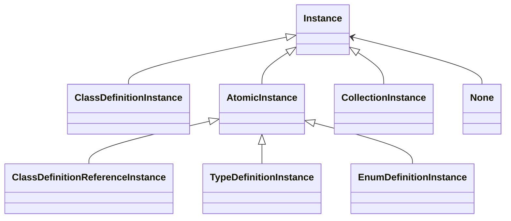
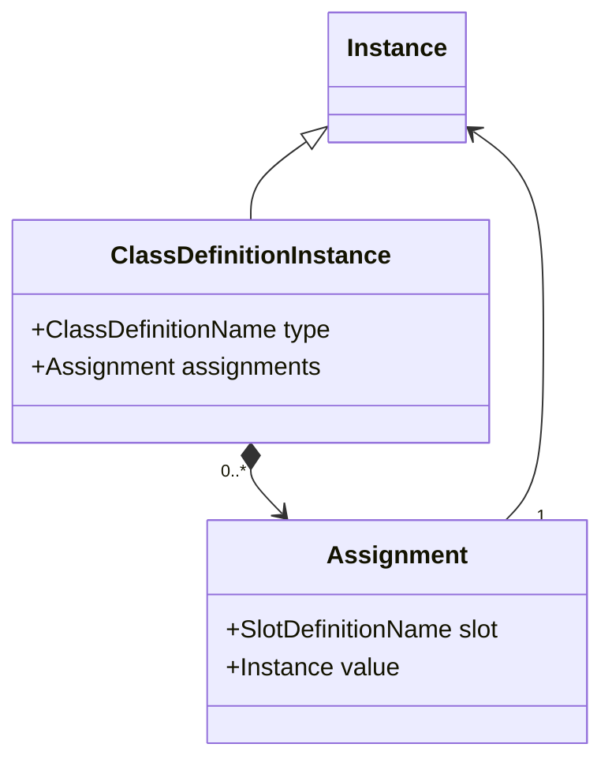
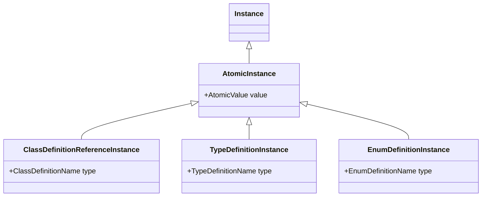
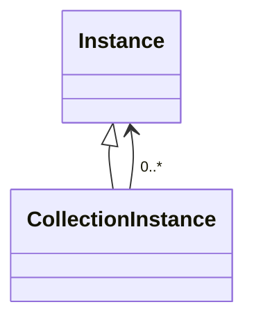

# LinkML Instances

## Functional Instance Syntax and Structure

This specification provides a grammar for a functional syntax for
expressing LinkML instances. This syntax is not intended for data
exchange, but instead for defining the structure of LinkML
instances. Mappings are provided later for other serializations.

### Instances

An instance is either one of four *definition* types, or a list of instances, or the special token `None`:

> **Instance** := **None** | **ClassDefinitionInstance** | **TypeDefinitionInstance** | **EnumDefinitionInstance** | **ClassDefinitionReferenceInstance** | **CollectionInstance**




### instances of ClassDefinition

A **ClassDefinitionInstance** is a pair consisting of (1) a
ClassDefinition *Name* and (2) zero to many *Assignments**, where each
assignment is a pair of a slot (attribute) and an instance value.

**ClassDefinitionInstance** := **ClassDefinitionName** '(' <**Assignment**>List ')'

**Assignment** := **SlotName** '=' **Instance**



No SlotName can appear twice in any ClassDefinitionInstance (i.e. SlotName is a key)

For example, given a class name **Person**, a ClassDefinition instance might look like:


```python
Person(id=...,
       name=...,
       <other slot-value assignments>)
```

The set of permitted slots for a class is defined by LinkML
*schema*. An instance can be syntactically valid (i.e conforming to the
grammar defined in this section) while structurally invalid (i.e not
conforming to a schema).

### Primitive Instances

There are 3 types of primitive instances, each is a pair consisting of (1) the definition name and (2) an atomic value

**TypeDefinitionInstance** := **TypeDefinitionName** '(' **AtomicValue** ')'

**EnumDefinitionInstance** := **EnumDefinitionName** '(' **AtomicValue** ')'

**ClassDefinitionReferenceInstance** := **ClassDefinitionReferenceName** '(' **AtomicValue** ')'



For example, given a type name **PhoneNumber**, a TypeDefinition instance might look like: 

```python
PhoneNumber("+1 800 555 0100")
```

And given a ClassDefinitionReference **PersonId**, a ClassDefinitionReference instance might look like: 

```python
PersonId("SSN:456")
```

This MAY be the same string used to identify an instance of a ClassDefinition `Person(id="SSN:456")`, but this is not required.

The semantics of these primitive instance types are defined by a *schema*


### Atomic Values

An atomic value is either a string or number or boolean, where numbers can be floating points, decimals, or integers.

**AtomicValue** := **StringValue** | **NumberValue** | **BooleanValue**

**StringValue** := *a finite sequence of characters in which " (U+22) and \ (U+5C) occur only in pairs of the form \" (U+5C, U+22) and \\ (U+5C, U+5C), enclosed in a pair of " (U+22) characters*

**NumberValue** := **FloatingPointValue** | **DecimalValue** | **IntegerValue**

**FloatingPointValue** ::= [ '+' | '-'] ( **Digits** ['.'**Digits**] [ **Exponent** ] | '.' **Digits** [ **Exponent** ]) ( 'f' | 'F' )

**Exponent** ::= ('e' | 'E') ['+' | '-'] **Digits**

**DecimalValue** ::= ['+' | '-'] **Digits** '.' **Digits** 

**IntegerValue** ::= ['+' | '-'] **Digits**


**NonNegativeInteger** ::= **Zero** | **PositiveInteger**

**PositiveInteger** ::= **NonZero** { **Digit** }

**Digits** ::= **Digit** { **Digit** }

**Digit** ::= **Zero** | **NonZero**

**NonZero** := '1' | '2' | '3' | '4' | '5' | '6' | '7' | '8' | '9'

**Zero** ::= '0'

**BooleanValue** ::= 'True' | 'False'

Examples of atomic values are:

* `180.2` -- a DecimalValue
* `5` -- an IntegerValue
* `"Alex"` -- a StringValue

### Collections

A collection is zero or more instances, serialized as a comma-delimited list:

**CollectionInstance** := '[' <**Instance**>List ']'



Examples of lists:

* `[String("A"), String("B"), Integer(5)]` -- a list of primitive instances
* `[Person(name=...), Person(name=...)]` -- a list of class instances
* `[]` -- an empty list

### None (Null) instances

A special symbol is included to indicate null or missing values

**None** := 'None'

An assignment of a slot to None is equivalent to omitting that assigment. I.e. the following two instance serializations are equivalent:

```
Person(address=None)
```

```
Person()
```

### Definition Names

Definition names are used to unambiguously indicate definitions specified in a schema

**ClassDefinitionName** := **Name**

**ClassDefinitionReferenceName** := **Name**

**TypeDefinitionName** := **Name**

**EnumDefinitionName** := **Name**

**SlotDefinitionName** := **Name**

**Name** := *a finite sequence of characters matching the PN_LOCAL production of [SPARQL] and not matching any of the keyword terminals of the syntax*

Note that the grammar needs a table mapping names to types in order to
unambiguously parse a serialization in functional syntax

names must not be shared across definition types

### Example

The following is an example of an instance of a ClassDefinition called **Person**:

```python
Person(
  id=String("SSN:123"),
  name=String("Alex"),
  aliases=[String("Alexandra")],
  address=None,
  phone=PhoneNumber("+1 800 555 0100"),
  height=
    Measurement(value=Decimal(170.2)
                unit=UnitCode("cm")),
  relationships=[
    FamilialRelationship(
      type=RelationshipType("SIBLING_OF"),
      related_to=PersonId("SSN:456")
    )
  ]
)                
```

See (YAML-Mapping)[#YAML-Mapping] for an example of the equivalent structure expressed in YAML.

Parsing this requires a table that maps definition names to schema element types:

|Definition Name|Type|
|---|---|
|Person|ClassDefinition|
|Measurement|ClassDefinition|
|FamilialRelationship|ClassDefinition|
|UnitCode|EnumDefinition|
|Person|ClassDefinition|

## Identity conditions

For two instances `i` and `j` to be identical they must be of the same metatype.

Identity conditions for two primitive instances are satisfied if both DefinitionName and AtomicValue match

**None** is identical to itself

Two collections are identical if they are of the same length and each member of `i` is identical to at least one member of `j`

Two ClassDefinition instances are identical if the instantiated ClassDefinitionName is identical and each non-None assignment
in *i* is identical an assignment in `j` and, and each non-None assignment in `j` is identical to an assignment in `i`

Two assignments are identical if the slot name is the same, and the value is identical

## Instance Serializations

The abstract syntax provided here is intended as a normative syntax for the purposes
of specifying the semantics of LinkML.

See future sections for details on how this functional syntax maps to other serialization
syntaxes and models such as JSON and RDF.

## Instance Accessor Syntax

For a given instance `i`, *accessor* syntax can be used to dereference values.

**Path** := **Source** { **PathExtension** }

**PathExtension** := '.' **SlotDefinitionName** | '[' **Identifier** ']'

To interpret an accessor for a given instance *i*:

- if the path extension is `.<s>` then *i* must be a ClassDefinition instance, and the value is equal to the value of the slot assignment for slot `s`
- if the path extension is `[<id>]` then *i* must be a Collection instance, and the value is equals to the member of that list that has a slot with the role of *identifier* whose value is `<id>`

For example, if *i* is equal to the Person instance in the example above:

* `i.id` == `String("SSN:123")`
* `i.height.unit` == `String("cm")`

