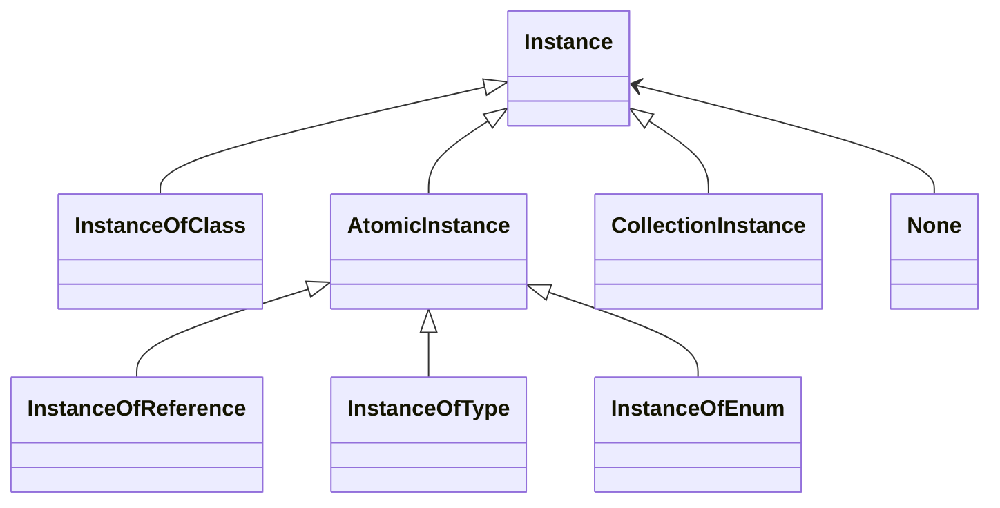
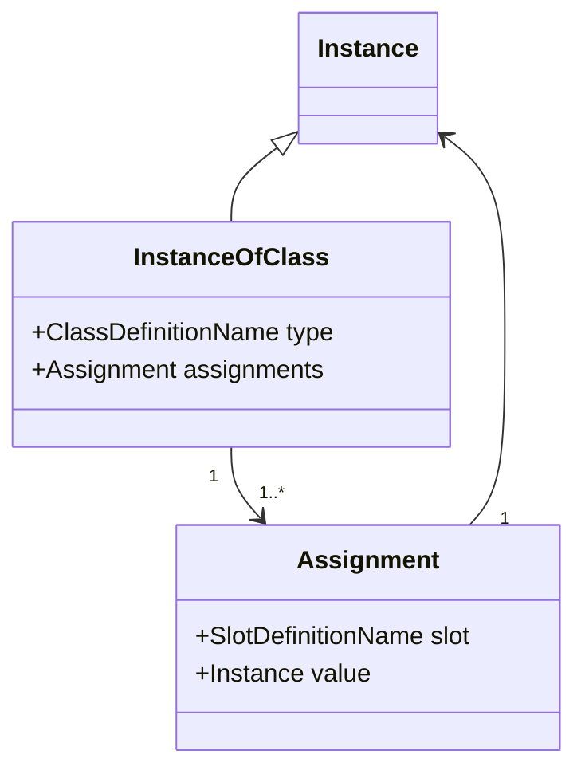
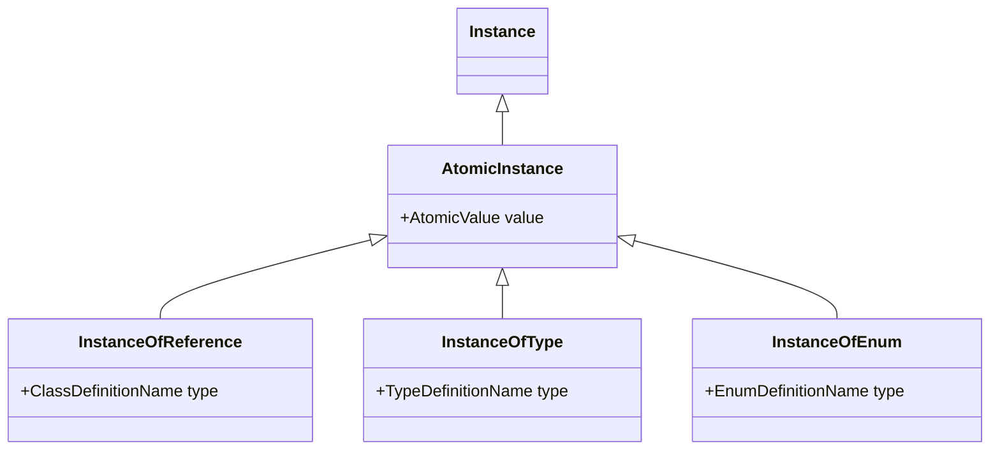
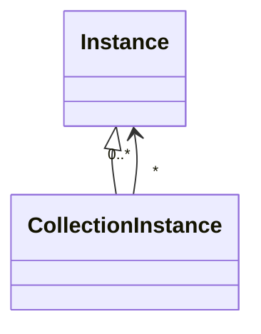

# LinkML Instances

## Functional Instance Syntax and Structure

This specification provides a grammar for a **functional syntax** for expressing LinkML instances. This syntax is not intended for data exchange, but instead for unambiguous describing data in LinkML.

[Section 6](06mapping) specifies how the instance model is converted to JSON, YAML, and RDF.

### Instances

An instance is either one of four *definition* types, or a collection, or the special token `None`. The four definition types are subdivided into instances of classes (aka objects), or atomic instances:

> **Instance** := **None** | **InstanceOfClass** | **AtomicInstance** | **CollectionInstance**
 
> **AtomicInstance** := **InstanceOfType** | **InstanceOfEnum** | **InstanceOfReference**



### Definition Types and Names

Definition names are used to unambiguously indicate definitions specified in a **Schema** (described in the [next section](03schemas)):

> **ClassDefinitionName** := **ElementName**

> **ClassDefinitionReferenceName** := **ElementName**

> **TypeDefinitionName** := **ElementName**

> **EnumDefinitionName** := **ElementName**

> **SlotDefinitionName** := **ElementName**

> **ElementName** := *a finite sequence of characters matching the PN_LOCAL production of [SPARQL](https://www.w3.org/TR/rdf-sparql-query/) and not matching any of the keyword terminals of the syntax*

Note that the grammar needs a table mapping names to types in order to
unambiguously parse a serialization in functional syntax

names must not be shared across definition types


### Instances of Classes

An **InstanceOfClass** is a pair consisting of (1) a ClassDefinition *Name* that indicates the *instantiation type* of the instance, and (2) zero to many *Assignments**, where each
assignment is a key-value pair of a **SlotName** and an **Instance** value.

> **InstanceOfClass** := **ClassDefinitionName** '(' <**Assignment**>List ')'

> **Assignment** := **SlotName** '=' **Instance**



No SlotName can appear twice in any set of Assignments (i.e. SlotName is a key)

An example instance might be written in functional syntax as:

```python
Person(id=...,
       name=...,
       age=...,
       <other Assignments>)
```

where this instantiates the class with name "Person".

### Primitive (Atomic) Instances

There are 3 types of primitive instances, each is a pair consisting of (1) a *Name* of the element instantiated (2) an atomic value

> **InstanceOfType** := **TypeDefinitionName** '(' **AtomicValue** ')'

> **InstanceOfEnum** := **EnumDefinitionName** '(' **AtomicValue** ')'

> **InstanceOfReference** := **ClassDefinitionReferenceName** '(' **AtomicValue** ')'




### Atomic Values

An atomic value is either a string or number or boolean, where numbers can be floating points, decimals, or integers.

> **AtomicValue** := **StringValue** | **NumberValue** | **BooleanValue**

> **StringValue** := *a finite sequence of characters in which " (U+22) and \ (U+5C) occur only in pairs of the form \" (U+5C, U+22) and \\ (U+5C, U+5C), enclosed in a pair of " (U+22) characters*

> **NumberValue** := **FloatingPointValue** | **DecimalValue** | **IntegerValue**

> **FloatingPointValue** ::= [ '+' | '-'] ( **Digits** ['.'**Digits**] [ **Exponent** ] | '.' **Digits** [ **Exponent** ]) ( 'f' | 'F' )

> **Exponent** ::= ('e' | 'E') ['+' | '-'] **Digits**

> **DecimalValue** ::= ['+' | '-'] **Digits** '.' **Digits** 

> **IntegerValue** ::= ['+' | '-'] **Digits**

> **NonNegativeInteger** ::= **Zero** | **PositiveInteger**

> **PositiveInteger** ::= **NonZero** { **Digit** }

> **Digits** ::= **Digit** { **Digit** }

> **Digit** ::= **Zero** | **NonZero**

> **NonZero** := '1' | '2' | '3' | '4' | '5' | '6' | '7' | '8' | '9'

> **Zero** ::= '0'

> **BooleanValue** ::= 'True' | 'False'

Examples of atomic values are:

* `180.2` -- a DecimalValue
* `5` -- an IntegerValue
* `"Alex"` -- a StringValue

#### Atomic Instance Examples

An InstanceOfType instance might look like:

```python
Integer(23)
```

For this to be a valid InstanceOfType, "Integer" must be the name of a TypeDefinition in the schema

Another example:

```python
PhoneNumber("+1 800 555 0100")
```

For this to be a valid InstanceOfType, "PhoneNumber" must be the name of a TypeDefinition in the schema

If the schema includes a ClassReference "PersonId" then the following is a valid InstanceOfReference

```python
PersonId("SSN:456")
```

This MAY be the same string used to identify an instance of a ClassDefinition `Person(id="SSN:456")`, but this is not required.

### Collections

A collection is zero or more instances, serialized as a comma-delimited list:

> **CollectionInstance** := '[' <**Instance**>List ']'



Examples of collections:

* `[String("A"), String("B"), Integer(5)]` -- a list of primitive instances
* `[Person(name=..., ...), Person(name=..., ...)]` -- a list of class instances
* `[Person(name=..., ...), Integer(5), None]` -- a heterogeneous collection
* `[]` -- an empty collection

### None (Null) instances

A special symbol is included to indicate null or missing values

> **None** := 'None'

An assignment of a slot to None is equivalent to omitting that assignment. I.e. the following two instance serializations are equivalent:

```
Person(address=None)
```

```
Person()
```


### Combined Example

The following is an example of an **InstanceOfClass** where the instantiated type is a class with name "Person":

```python
Person(
  id=String("SSN:123"),
  name=String("Alex"),
  aliases=[String("Alexandra")],
  address=None,
  phone=PhoneNumber("+1 800 555 0100"),
  height=
    Measurement(value=Decimal(170.2)
                unit=UnitCode("cm")),
  relationships=[
    FamilialRelationship(
      type=RelationshipType("SIBLING_OF"),
      related_to=PersonId("SSN:456")
    )
  ]
)                
```

Parsing this requires a schema that assigns element names to schema elements:

|Element Name|Schema Type|
|---|---|
|Person|ClassDefinition|
|Measurement|ClassDefinition|
|FamilialRelationship|ClassDefinition|
|UnitCode|EnumDefinition|
|Person|ClassDefinition|

## Identity conditions

For two instances `i` and `j` to be identical they must be of the same metatype.

Identity conditions for two primitive instances are satisfied if both **DefinitionName** and **AtomicValue** match

* `i=<DefinitionName_i>(<AtomicValue_i>)`
* `j=<DefinitionName_j>(<AtomicValue_j>)`
* `i=j iff DefinitionName_i = DefinitionName_j and AtomicValue_i=AtomicValue_j`

**None** is identical to itself

Two collections are identical if they are of the same length and each member of `i` is identical to at least one member of `j`, where each match must be unique

Two ClassDefinition instances are identical if the instantiated **ClassDefinitionName** is identical and each non-**None** assignment
in `i` is identical an assignment in `j` and, and each non-None assignment in `j` is identical to an assignment in `i`

Two assignments are identical if the slot name is the same, and the value is identical

## Instance Serializations

The abstract syntax provided here is intended as a normative syntax for the purposes
of specifying the semantics of LinkML.

See [section 6](06mapping) for details on how this functional syntax maps to other serialization
syntaxes and models such as JSON and RDF.

## Instance Accessor Syntax

For a given instance `i`, *accessor* syntax can be used to dereference values.

> **Path** := **SlotDefinitionName** { **PathExtension** }

> **PathExtension** := '.' **SlotDefinitionName** | '[' **Identifier** ']'

To interpret an accessor for a given instance *i*:

- if the path extension is `.<s>` then *i* must be an **InstanceOfClass*, and the value is equal to the value of the slot assignment for slot `s`
- if the path extension is `[<id>]` then *i* must be an **InstanceOfCollection**, and the value is equals to the member of that list that has a slot with the role of *identifier* whose value is `<id>`

For example, if *i* is equal to the Person instance in the example above:

* `i.id` == `String("SSN:123")`
* `i.height.unit` == `String("cm")`

