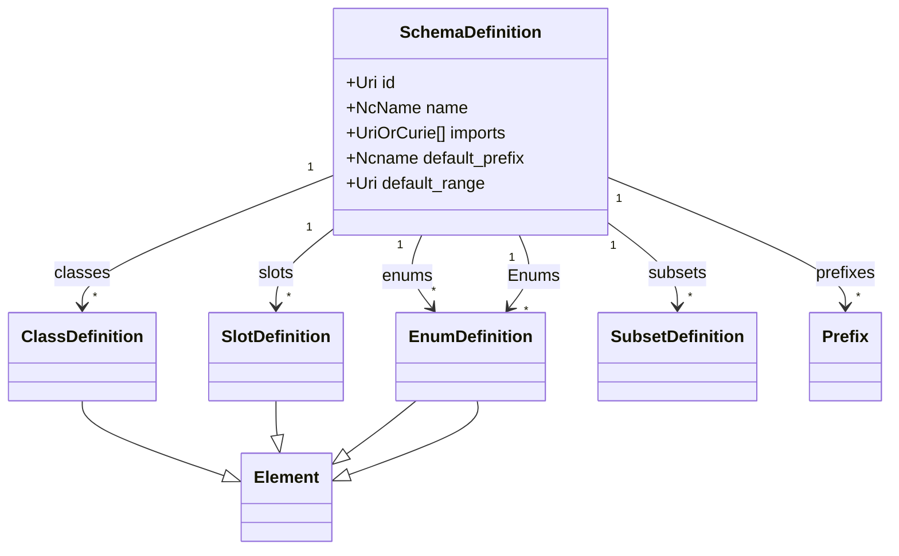
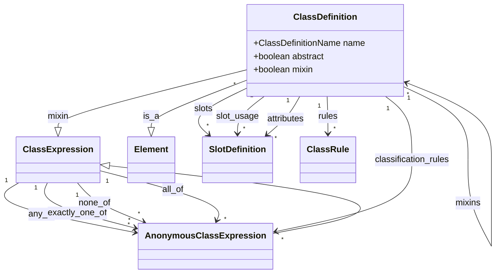
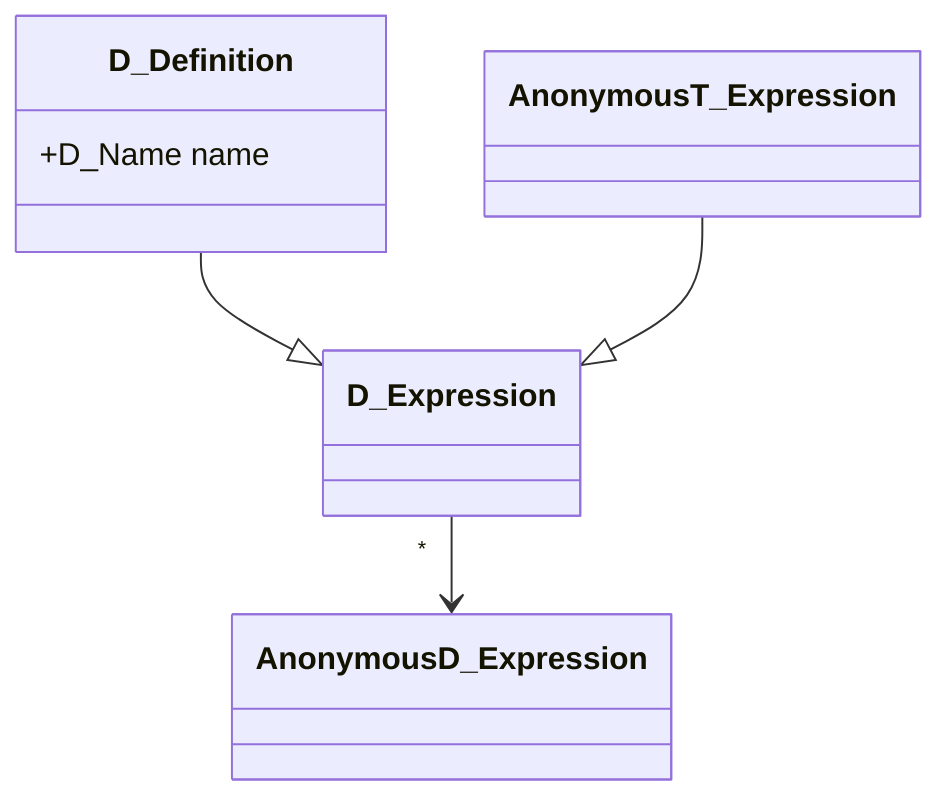
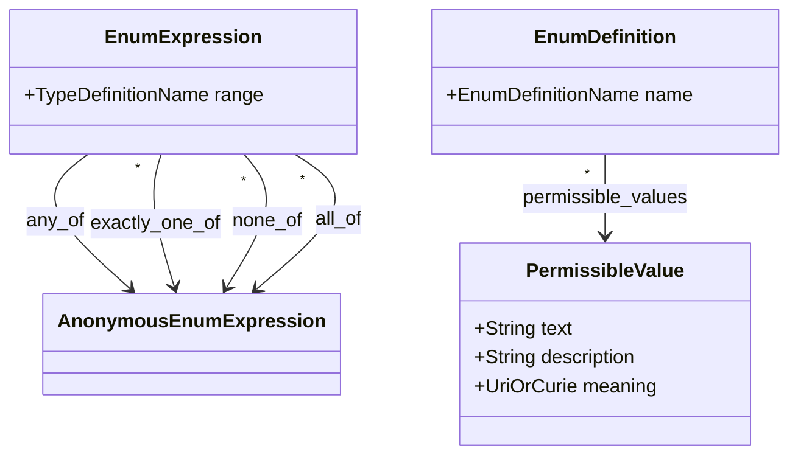
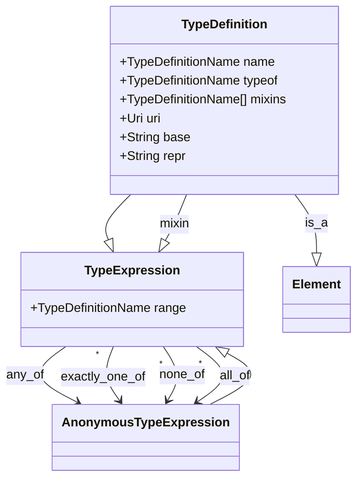
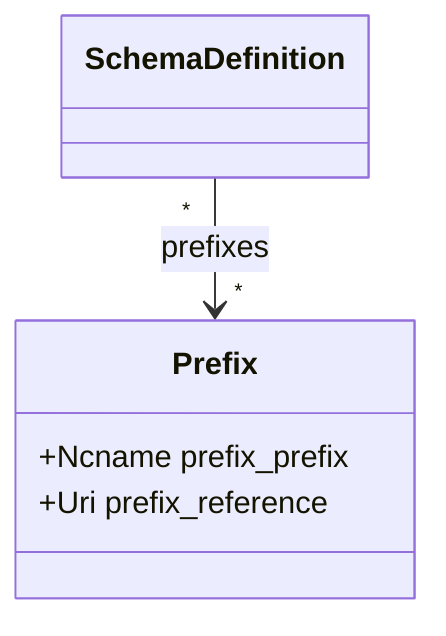
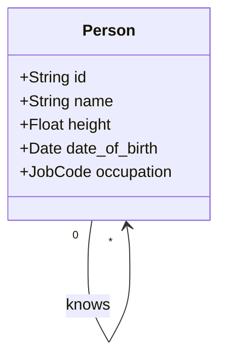

# Schema Data Model

This section describes the *structure* of a LinkML schema. For precise interpretation of these structures, refer to the following two sections on *derived schemas* and *validation*

## Schema Basics

A LinkML **schema** specifies rules and structural conformance conditions for **instances**. Schemas allow for:

- parsing of instance **serializations** to LinkML instance structures
- structurally and semantically **validating** LinkML instance structures
- **inference** of missing values in LinkML instance structures

Every LinkML schema *m* is itself an instance of a special class [SchemaDefinition](https://w3id.org/linkml/SchemaDefinition) that forms part of a special schema called the **LinkML metamodel**, which is denoted by *m<sup>M</sup>*. There is exactly one metamodel.

In this specification:

 - ClassDefinitions in *m<sup>M</sup>* are called **metaclasses**
 - SlotDefinitions in *m<sup>M</sup>* are called **metaslots**

The metamodel is itself expressed in LinkML, and the latest version can found from canonical URLs:

* [https://w3id.org/linkml/SchemaDefinition](https://w3id.org/linkml/SchemaDefinition) -- generated documentation
* [https://w3id.org/linkml/meta.yaml](https://w3id.org/linkml/meta.yaml) -- canonical YAML serialization

This specification specifies the *normative elements* necessary to specify the behavior of LinkML schemas. Schemas may have additional
elements provided in the metamodel. For example, elements in schemas can have *informative* slot assignments for slots such as [title](https://w3id.org/linkml/title), [description](https://w3id.org/linkml/description), and so on, but these slots are not described in this specification as they are not normative and do not affect the formal interpretation of schemas.

The subset of the metamodel that corresponds to the specification is called the SpecificationProfile, and it is found at:

* [https://w3id.org/linkml/SpecificationProfile](https://w3id.org/linkml/SpecificationProfile) 

### YAML representation of schemas

Because schemas and all the parts of a schema are instances of metaclasses in the metamodel, the YAML serialization rules from [section 6](06mapping) can be applied to both serialized and deserialized a schema as YAML.

### Analogies to other modeling frameworks

To help understand the basic concepts, it can be helpful to think about analogous structures in other frameworks.
However, it should be understood these are not equivalents.

 * ClassDefinitions are analogous to: 
      - [classes](https://en.wikipedia.org/wiki/Class_(computer_programming)) in object-oriented languages 
      - tables in relational databases and spreadsheets
      - owl:Class entities in RDFS/OWL
 * SlotDefinitions are analogous to:
     - [attributes](https://en.wikipedia.org/wiki/Attribute_(computing)) in object-oriented languages
     - columns or fields in relational databases and spreadsheets
     - properties in JSON-Schema
     - rdf:Property entities in RDFS/OWL
 * EnumDefinitions are analogous to:
     - [enumerated types](https://en.wikipedia.org/wiki/Enumerated_type) in programming languages and some relational systems
     - drop-down selections in spreadsheets       
     - Note however that in LinkML enums are optionally backed by stronger semantics with enum elements (permissible values) mapped to vocabularies or ontologies
 * EnumDefinitions are analogous to:
     - [data types](https://en.wikipedia.org/wiki/Data_type) in most object-oriented languages 
     - primitive types in database systems
     - extensible types in some systems
     - rdf:Literals in RDF
     - Datatypes in OWL

## SchemaDefinition Metaclass

* metamodel documentation: [SchemaDefinition](https://w3id.org/linkml/SchemaDefinition)

### SchemaDefinition: Normative subset metaslots

A schema *m* is an instance of a SchemaDefinition, with normative elements:

| Name | Cardinality and Range  | Description  |
| ---  | ---  | --- |
| [id](https://w3id.org/linkml/id) | 1..1 <br/> [xsd:anyURI](http://www.w3.org/2001/XMLSchema#anyURI)  | The official schema URI   |
| [name](https://w3id.org/linkml/name) | 1..1 <br/> [xsd:string](http://www.w3.org/2001/XMLSchema#string)  | a unique name for the schema that is both human-readable and consists of only... **identifier**  |
| [classes](https://w3id.org/linkml/classes) | 0..* <br/> [ClassDefinition](https://w3id.org/linkml/ClassDefinition)  | An index to the collection of all class definitions in the schema   |
| [slot_definitions](https://w3id.org/linkml/slot_definitions) | 0..* <br/> [SlotDefinition](https://w3id.org/linkml/SlotDefinition)  | An index to the collection of all slot definitions in the schema   |
| [enums](https://w3id.org/linkml/enums) | 0..* <br/> [EnumDefinition](https://w3id.org/linkml/EnumDefinition)  | An index to the collection of all enum definitions in the schema   |
| [subsets](https://w3id.org/linkml/subsets) | 0..* <br/> [SubsetDefinition](https://w3id.org/linkml/SubsetDefinition)  | An index to the collection of all subset definitions in the schema   |
| [prefixes](https://w3id.org/linkml/prefixes) | 0..* <br/> [Prefix](https://w3id.org/linkml/Prefix)  | prefix / URI definitions to be added to the context beyond those fetched from...   |
| [default_prefix](https://w3id.org/linkml/default_prefix) | 0..1 <br/> [xsd:string](http://www.w3.org/2001/XMLSchema#string)  | default and base prefix -- used for ':' identifiers, @base and @vocab   |
| [default_range](https://w3id.org/linkml/default_range) | 0..1 <br/> [TypeDefinition](https://w3id.org/linkml/TypeDefinition)  | default slot range to be used if range element is omitted from a slot definit...   |
| [settings](https://w3id.org/linkml/settings) | 0..* <br/> [Setting](https://w3id.org/linkml/Setting)  | A collection of global variable settings   |
| [imports](https://w3id.org/linkml/imports) | 0..* <br/> [xsd:anyURI](http://www.w3.org/2001/XMLSchema#anyURI)  | other schemas that are included in this schema   |
| [rank](https://w3id.org/linkml/rank) | 0..1 <br/> [xsd:integer](http://www.w3.org/2001/XMLSchema#integer)  | the relative order in which the element occurs, lower values are given preced...   |
| [id_prefixes](https://w3id.org/linkml/id_prefixes) | 0..* <br/> [xsd:string](http://www.w3.org/2001/XMLSchema#string)  | the identifier of this class or slot must begin with the URIs referenced by t...   |
| [from_schema](https://w3id.org/linkml/from_schema) | 0..1 <br/> [xsd:anyURI](http://www.w3.org/2001/XMLSchema#anyURI)  | id of the schema that defined the element   |


### SchemaDefinition: Normative subset UML

A subset of the above normative slots are depicted as follows:



### Schema example, functional syntax

The skeleton of a schema instance serialized as in functional syntax might look like:

```
SchemaDefinition(
  id=String('http://example.org/organization'),
  imports=[...],
  prefixes=[...],
  classes=[...],
  slots=[...],
  enums=[...],
  types=[...],
)  
```

### Schema example, YAML

The skeleton of the above schema instance serialized as YAML might look like:

```yaml
id: http://example.org/personinfo
imports:
  ...
prefixes:
  ...
classes:
  ...
slots:
  ...
enums:
  ...
types:
  ...
```


## ClassDefinition Metaclass

* metamodel documentation: [ClassDefinition](https://w3id.org/linkml/ClassDefinition)

Instances of **ClassDefinition** are themselves *instantiable*. For example, a schema may contain a class definition "Person". This class definition instantiates the metaclass **ClassDefinition**, and can have instances, of actual persons.

Any LinkML instance that instantiates a ClassDefinition will have zero to many slot-value assignments, constrained
by rules that operate off of the metaslot assignments of that class.

### ClassDefinition: Normative subset metaslots

Any instance *c* of a ClassDefinition may have assignments in any of the following normative metaslots

| Name | Cardinality and Range  | Description  |
| ---  | ---  | --- |
| [name](https://w3id.org/linkml/name) | 1..1 <br/> [xsd:string](http://www.w3.org/2001/XMLSchema#string)  | the unique name of the element within the context of the schema **identifier**  |
| [class_uri](https://w3id.org/linkml/class_uri) | 0..1 <br/> [xsd:anyURI](http://www.w3.org/2001/XMLSchema#anyURI)  | URI of the class that provides a semantic interpretation of the element in a ...   |
| [is_a](https://w3id.org/linkml/is_a) | 0..1 <br/> [ClassDefinition](https://w3id.org/linkml/ClassDefinition)  | A primary parent class from which inheritable metaslots are propagated   |
| [mixins](https://w3id.org/linkml/mixins) | 0..* <br/> [ClassDefinition](https://w3id.org/linkml/ClassDefinition)  | A collection of secondary parent mixin classes from which inheritable metaslo...   |
| [slots](https://w3id.org/linkml/slots) | 0..* <br/> [SlotDefinition](https://w3id.org/linkml/SlotDefinition)  | collection of slot names that are applicable to a class   |
| [slot_usage](https://w3id.org/linkml/slot_usage) | 0..* <br/> [SlotDefinition](https://w3id.org/linkml/SlotDefinition)  | the refinement of a slot in the context of the containing class definition   |
| [attributes](https://w3id.org/linkml/attributes) | 0..* <br/> [SlotDefinition](https://w3id.org/linkml/SlotDefinition)  | Inline definition of slots   |
| [tree_root](https://w3id.org/linkml/tree_root) | 0..1 <br/> [xsd:boolean](http://www.w3.org/2001/XMLSchema#boolean)  | indicator that this is the root class in tree structures   |
| [rank](https://w3id.org/linkml/rank) | 0..1 <br/> [xsd:integer](http://www.w3.org/2001/XMLSchema#integer)  | the relative order in which the element occurs, lower values are given preced...   |
| [any_of](https://w3id.org/linkml/any_of) | 0..* <br/> [AnonymousClassExpression](https://w3id.org/linkml/AnonymousClassExpression)  | holds if at least one of the expressions hold   |
| [exactly_one_of](https://w3id.org/linkml/exactly_one_of) | 0..* <br/> [AnonymousClassExpression](https://w3id.org/linkml/AnonymousClassExpression)  | holds if only one of the expressions hold   |
| [none_of](https://w3id.org/linkml/none_of) | 0..* <br/> [AnonymousClassExpression](https://w3id.org/linkml/AnonymousClassExpression)  | holds if none of the expressions hold   |
| [all_of](https://w3id.org/linkml/all_of) | 0..* <br/> [AnonymousClassExpression](https://w3id.org/linkml/AnonymousClassExpression)  | holds if all of the expressions hold   |
| [union_of](https://w3id.org/linkml/union_of) | 0..* <br/> [ClassDefinition](https://w3id.org/linkml/ClassDefinition)  | indicates that the domain element consists exactly of the members of the elem...   |
| [unique_keys](https://w3id.org/linkml/unique_keys) | 0..* <br/> [UniqueKey](https://w3id.org/linkml/UniqueKey)  | A collection of unique keys for this class   |
| [rules](https://w3id.org/linkml/rules) | 0..* <br/> [ClassRule](https://w3id.org/linkml/ClassRule)  | the collection of rules that apply to all members of this class   |
| [classification_rules](https://w3id.org/linkml/classification_rules) | 0..* <br/> [AnonymousClassExpression](https://w3id.org/linkml/AnonymousClassExpression)  | the collection of classification rules that apply to all members of this clas...   |
| [disjoint_with](https://w3id.org/linkml/disjoint_with) | 0..* <br/> [ClassDefinition](https://w3id.org/linkml/ClassDefinition)  | Two classes are disjoint if they have no instances in common, two slots are d...   |
| [slot_conditions](https://w3id.org/linkml/slot_conditions) | 0..* <br/> [SlotDefinition](https://w3id.org/linkml/SlotDefinition)  | expresses constraints on a group of slots for a class expression   |
| [abstract](https://w3id.org/linkml/abstract) | 0..1 <br/> [xsd:boolean](http://www.w3.org/2001/XMLSchema#boolean)  | Indicates the class or slot cannot be directly instantiated and is intended f...   |
| [mixin](https://w3id.org/linkml/mixin) | 0..1 <br/> [xsd:boolean](http://www.w3.org/2001/XMLSchema#boolean)  | Indicates the class or slot is not intended to inherited from without being a...   |
| [string_serialization](https://w3id.org/linkml/string_serialization) | 0..1 <br/> [xsd:string](http://www.w3.org/2001/XMLSchema#string)  | Used on a slot that stores the string serialization of the containing object   |
| [id_prefixes](https://w3id.org/linkml/id_prefixes) | 0..* <br/> [xsd:string](http://www.w3.org/2001/XMLSchema#string)  | the identifier of this class or slot must begin with the URIs referenced by t...   |
| [from_schema](https://w3id.org/linkml/from_schema) | 0..1 <br/> [xsd:anyURI](http://www.w3.org/2001/XMLSchema#anyURI)  | id of the schema that defined the element   |


### ClassDefinition: UML

A subset of the above normative slots are depicted as follows:



### ClassExpressions and anonymous ClassExpressions

Note this metaclass exemplifies a pattern that is reused by TypeDefinition, SlotDefinition and EnumDefinition metaclasses, below.

For the core definition types `<D>`, there are a triad of 3 metaclasses in the metamodel:

* `<D>Expression`
   * `Anonymous<D>Expression`
   * `<D>Definition`

depicted as:



For many purposes, all that is required is the Definition element. The purpose of the above abstraction is to allow
composition of anonymous expressions using boolean operators. For example, we may want to refer to the union of collection
of ClassDefinitions.

### Class Definition Example, Functional Syntax

A collection of ClassDefinition instances might look 

```python
[  
   ClassDefinition(
    name=String("NamedThing"),
    abstract=True,
    slots=[
        String("id"),
        String("name"),
        ...
      ]
    ),
   ClassDefinition(
    name=String("Person"),
    description=String("A person, living or dead"),
    is_a=String("NamedThing"),
    attributes=[
        SlotDefinition(
            name=String("height"),
            ...),
        SlotDefinition(
            name=String("age"),
            ...)
   ),
   ...
],
```

### Class Definition Example, YAML

The above example following the YAML serialization is:

```yaml
NamedThing:
   abstract: true
   slots:
      - id
      - name
Person:
   description: A person, living or dead
   is_a: NamedThing
   attributes:
      height:
         ...
      age:
         ...
```

## SlotDefinition Metaclass

* metamodel documentation: [SlotDefinition](https://w3id.org/linkml/SlotDefinition)

Instances of **SlotDefinition** are not themselves *instantiable*. Each **assignment** in a LinkML **ClassDefinition** instance must use a SlotDefinition from the schema.

### SlotDefinition: Normative subset metaslots

SlotDefinition inherits from both Element and SlotExpression. A SlotDefinition must have a *name*.
other schema elements may refer to **AnonymousSlotExpression**s composed using boolean operators.

Any instance *s* of a SlotDefinition may have assignments in any of the following normative metaslots

| Name | Cardinality and Range  | Description  |
| ---  | ---  | --- |
| [name](https://w3id.org/linkml/name) | 1..1 <br/> [xsd:string](http://www.w3.org/2001/XMLSchema#string)  | the unique name of the element within the context of the schema **identifier**  |
| [slot_uri](https://w3id.org/linkml/slot_uri) | 0..1 <br/> [xsd:anyURI](http://www.w3.org/2001/XMLSchema#anyURI)  | predicate of this slot for semantic web application   |
| [identifier](https://w3id.org/linkml/identifier) | 0..1 <br/> [xsd:boolean](http://www.w3.org/2001/XMLSchema#boolean)  | True means that the key slot(s) uniquely identify the container   |
| [alias](https://w3id.org/linkml/alias) | 0..1 <br/> [xsd:string](http://www.w3.org/2001/XMLSchema#string)  | the name used for a slot in the context of its owning class   |
| [multivalued](https://w3id.org/linkml/multivalued) | 0..1 <br/> [xsd:boolean](http://www.w3.org/2001/XMLSchema#boolean)  | true means that slot can have more than one value   |
| [required](https://w3id.org/linkml/required) | 0..1 <br/> [xsd:boolean](http://www.w3.org/2001/XMLSchema#boolean)  | true means that the slot must be present in the loaded definition   |
| [recommended](https://w3id.org/linkml/recommended) | 0..1 <br/> [xsd:boolean](http://www.w3.org/2001/XMLSchema#boolean)  | true means that the slot should be present in the loaded definition, but this...   |
| [is_a](https://w3id.org/linkml/is_a) | 0..1 <br/> [SlotDefinition](https://w3id.org/linkml/SlotDefinition)  | A primary parent slot from which inheritable metaslots are propagated   |
| [mixins](https://w3id.org/linkml/mixins) | 0..* <br/> [SlotDefinition](https://w3id.org/linkml/SlotDefinition)  | A collection of secondary parent mixin slots from which inheritable metaslots...   |
| [inlined](https://w3id.org/linkml/inlined) | 0..1 <br/> [xsd:boolean](http://www.w3.org/2001/XMLSchema#boolean)  | True means that keyed or identified slot appears in an outer structure by val...   |
| [inlined_as_list](https://w3id.org/linkml/inlined_as_list) | 0..1 <br/> [xsd:boolean](http://www.w3.org/2001/XMLSchema#boolean)  | True means that an inlined slot is represented as a list of range instances   |
| [pattern](https://w3id.org/linkml/pattern) | 0..1 <br/> [xsd:string](http://www.w3.org/2001/XMLSchema#string)  | the string value of the slot must conform to this regular expression expresse...   |
| [rank](https://w3id.org/linkml/rank) | 0..1 <br/> [xsd:integer](http://www.w3.org/2001/XMLSchema#integer)  | the relative order in which the element occurs, lower values are given preced...   |
| [any_of](https://w3id.org/linkml/any_of) | 0..* <br/> [AnonymousSlotExpression](https://w3id.org/linkml/AnonymousSlotExpression)  | holds if at least one of the expressions hold   |
| [exactly_one_of](https://w3id.org/linkml/exactly_one_of) | 0..* <br/> [AnonymousSlotExpression](https://w3id.org/linkml/AnonymousSlotExpression)  | holds if only one of the expressions hold   |
| [none_of](https://w3id.org/linkml/none_of) | 0..* <br/> [AnonymousSlotExpression](https://w3id.org/linkml/AnonymousSlotExpression)  | holds if none of the expressions hold   |
| [all_of](https://w3id.org/linkml/all_of) | 0..* <br/> [AnonymousSlotExpression](https://w3id.org/linkml/AnonymousSlotExpression)  | holds if all of the expressions hold   |
| [domain](https://w3id.org/linkml/domain) | 0..1 <br/> [ClassDefinition](https://w3id.org/linkml/ClassDefinition)  | defines the type of the subject of the slot   |
| [inherited](https://w3id.org/linkml/inherited) | 0..1 <br/> [xsd:boolean](http://www.w3.org/2001/XMLSchema#boolean)  | true means that the *value* of a slot is inherited by subclasses   |
| [ifabsent](https://w3id.org/linkml/ifabsent) | 0..1 <br/> [xsd:string](http://www.w3.org/2001/XMLSchema#string)  | function that provides a default value for the slot   |
| [list_elements_unique](https://w3id.org/linkml/list_elements_unique) | 0..1 <br/> [xsd:boolean](http://www.w3.org/2001/XMLSchema#boolean)  | If True, then there must be no duplicates in the elements of a multivalued sl...   |
| [list_elements_ordered](https://w3id.org/linkml/list_elements_ordered) | 0..1 <br/> [xsd:boolean](http://www.w3.org/2001/XMLSchema#boolean)  | If True, then the order of elements of a multivalued slot is guaranteed to be...   |
| [shared](https://w3id.org/linkml/shared) | 0..1 <br/> [xsd:boolean](http://www.w3.org/2001/XMLSchema#boolean)  | If True, then the relationship between the slot domain and range is many to o...   |
| [key](https://w3id.org/linkml/key) | 0..1 <br/> [xsd:boolean](http://www.w3.org/2001/XMLSchema#boolean)  | True means that the key slot(s) uniquely identify the container   |
| [designates_type](https://w3id.org/linkml/designates_type) | 0..1 <br/> [xsd:boolean](http://www.w3.org/2001/XMLSchema#boolean)  | True means that the key slot(s) is used to determine the instantiation (types...   |
| [symmetric](https://w3id.org/linkml/symmetric) | 0..1 <br/> [xsd:boolean](http://www.w3.org/2001/XMLSchema#boolean)  | If s is symmetric, and i   |
| [reflexive](https://w3id.org/linkml/reflexive) | 0..1 <br/> [xsd:boolean](http://www.w3.org/2001/XMLSchema#boolean)  | If s is reflexive, then i   |
| [locally_reflexive](https://w3id.org/linkml/locally_reflexive) | 0..1 <br/> [xsd:boolean](http://www.w3.org/2001/XMLSchema#boolean)  | If s is locally_reflexive, then i   |
| [irreflexive](https://w3id.org/linkml/irreflexive) | 0..1 <br/> [xsd:boolean](http://www.w3.org/2001/XMLSchema#boolean)  | If s is irreflexive, then there exists no i such i   |
| [asymmetric](https://w3id.org/linkml/asymmetric) | 0..1 <br/> [xsd:boolean](http://www.w3.org/2001/XMLSchema#boolean)  | If s is antisymmetric, and i   |
| [transitive](https://w3id.org/linkml/transitive) | 0..1 <br/> [xsd:boolean](http://www.w3.org/2001/XMLSchema#boolean)  | If s is transitive, and i   |
| [inverse](https://w3id.org/linkml/inverse) | 0..1 <br/> [SlotDefinition](https://w3id.org/linkml/SlotDefinition)  | indicates that any instance of d s r implies that there is also an instance o...   |
| [transitive_form_of](https://w3id.org/linkml/transitive_form_of) | 0..1 <br/> [SlotDefinition](https://w3id.org/linkml/SlotDefinition)  | If s transitive_form_of d, then (1) s holds whenever d holds (2) s is transit...   |
| [reflexive_transitive_form_of](https://w3id.org/linkml/reflexive_transitive_form_of) | 0..1 <br/> [SlotDefinition](https://w3id.org/linkml/SlotDefinition)  | transitive_form_of including the reflexive case   |
| [slot_group](https://w3id.org/linkml/slot_group) | 0..1 <br/> [SlotDefinition](https://w3id.org/linkml/SlotDefinition)  | allows for grouping of related slots into a grouping slot that serves the rol...   |
| [is_grouping_slot](https://w3id.org/linkml/is_grouping_slot) | 0..1 <br/> [xsd:boolean](http://www.w3.org/2001/XMLSchema#boolean)  | true if this slot is a grouping slot   |
| [disjoint_with](https://w3id.org/linkml/disjoint_with) | 0..* <br/> [SlotDefinition](https://w3id.org/linkml/SlotDefinition)  | Two classes are disjoint if they have no instances in common, two slots are d...   |
| [union_of](https://w3id.org/linkml/union_of) | 0..* <br/> [TypeDefinition](https://w3id.org/linkml/TypeDefinition)  | indicates that the domain element consists exactly of the members of the elem...   |
| [range](https://w3id.org/linkml/range) | 0..1 <br/> [Element](https://w3id.org/linkml/Element)  | defines the type of the object of the slot   |
| [range_expression](https://w3id.org/linkml/range_expression) | 0..1 <br/> [AnonymousClassExpression](https://w3id.org/linkml/AnonymousClassExpression)  | A range that is described as a boolean expression combining existing ranges   |
| [enum_range](https://w3id.org/linkml/enum_range) | 0..1 <br/> [EnumExpression](https://w3id.org/linkml/EnumExpression)  | An inlined enumeration   |
| [minimum_value](https://w3id.org/linkml/minimum_value) | 0..1 <br/> [xsd:integer](http://www.w3.org/2001/XMLSchema#integer)  | for slots with ranges of type number, the value must be equal to or higher th...   |
| [maximum_value](https://w3id.org/linkml/maximum_value) | 0..1 <br/> [xsd:integer](http://www.w3.org/2001/XMLSchema#integer)  | for slots with ranges of type number, the value must be equal to or lowe than...   |
| [structured_pattern](https://w3id.org/linkml/structured_pattern) | 0..1 <br/> [PatternExpression](https://w3id.org/linkml/PatternExpression)  | the string value of the slot must conform to the regular expression in the pa...   |
| [implicit_prefix](https://w3id.org/linkml/implicit_prefix) | 0..1 <br/> [xsd:string](http://www.w3.org/2001/XMLSchema#string)  | Causes the slot value to be interpreted as a uriorcurie after prefixing with ...   |
| [equals_string](https://w3id.org/linkml/equals_string) | 0..1 <br/> [xsd:string](http://www.w3.org/2001/XMLSchema#string)  | the slot must have range string and the value of the slot must equal the spec...   |
| [equals_string_in](https://w3id.org/linkml/equals_string_in) | 0..* <br/> [xsd:string](http://www.w3.org/2001/XMLSchema#string)  | the slot must have range string and the value of the slot must equal one of t...   |
| [equals_expression](https://w3id.org/linkml/equals_expression) | 0..1 <br/> [xsd:string](http://www.w3.org/2001/XMLSchema#string)  | the value of the slot must equal the value of the evaluated expression   |
| [minimum_cardinality](https://w3id.org/linkml/minimum_cardinality) | 0..1 <br/> [xsd:integer](http://www.w3.org/2001/XMLSchema#integer)  | the minimum number of entries for a multivalued slot   |
| [maximum_cardinality](https://w3id.org/linkml/maximum_cardinality) | 0..1 <br/> [xsd:integer](http://www.w3.org/2001/XMLSchema#integer)  | the maximum number of entries for a multivalued slot   |
| [has_member](https://w3id.org/linkml/has_member) | 0..1 <br/> [AnonymousSlotExpression](https://w3id.org/linkml/AnonymousSlotExpression)  | the values of the slot is multivalued with at least one member satisfying the...   |
| [all_members](https://w3id.org/linkml/all_members) | 0..* <br/> [SlotDefinition](https://w3id.org/linkml/SlotDefinition)  | the value of the multiavlued slot is a list where all elements conform to the...   |
| [abstract](https://w3id.org/linkml/abstract) | 0..1 <br/> [xsd:boolean](http://www.w3.org/2001/XMLSchema#boolean)  | Indicates the class or slot cannot be directly instantiated and is intended f...   |
| [mixin](https://w3id.org/linkml/mixin) | 0..1 <br/> [xsd:boolean](http://www.w3.org/2001/XMLSchema#boolean)  | Indicates the class or slot is not intended to inherited from without being a...   |
| [string_serialization](https://w3id.org/linkml/string_serialization) | 0..1 <br/> [xsd:string](http://www.w3.org/2001/XMLSchema#string)  | Used on a slot that stores the string serialization of the containing object   |
| [id_prefixes](https://w3id.org/linkml/id_prefixes) | 0..* <br/> [xsd:string](http://www.w3.org/2001/XMLSchema#string)  | the identifier of this class or slot must begin with the URIs referenced by t...   |
| [from_schema](https://w3id.org/linkml/from_schema) | 0..1 <br/> [xsd:anyURI](http://www.w3.org/2001/XMLSchema#anyURI)  | id of the schema that defined the element   |

### SlotDefinition: Normative subset UML

A subset of the above normative slots are depicted as follows:


### Slot Definition Example, Functional Syntax

An example collection of SlotDefinitions might be:

```python
SchemaDefinition(
  slots=[
   SlotDefinition(
    name=String("id"),
    identifier=Boolean(True),
    description=String("A unique identifier for an object"),
    range=String("String"),
    ...
    ),
   SlotDefinition(
    name=String("name"),
    description=String("..."),
    range=String("String"),
    ...
    )
```

## EnumDefinition Metaclass

* metamodel documentation: [EnumDefinition](https://w3id.org/linkml/EnumDefinition)

Instances of **EnumDefinition** instances are *instantiable*. For example, a schema may have an enumeration with name "JobCode". This is an instance of an EnumDefinition, and can also be instantiated by different **permissible values** such as "Forklift Driver"

### EnumDefinition: Normative subset metaslots

Any instance *e* of a EnumDefinition may have assignments in any of the following normative metaslots:

| Name | Cardinality and Range  | Description  |
| ---  | ---  | --- |
| [name](https://w3id.org/linkml/name) | 1..1 <br/> [xsd:string](http://www.w3.org/2001/XMLSchema#string)  | the unique name of the element within the context of the schema **identifier**  |
| [is_a](https://w3id.org/linkml/is_a) | 0..1 <br/> [Definition](https://w3id.org/linkml/Definition)  | A primary parent class or slot from which inheritable metaslots are propagate...   |
| [mixins](https://w3id.org/linkml/mixins) | 0..* <br/> [Definition](https://w3id.org/linkml/Definition)  | A collection of secondary parent classes or slots from which inheritable meta...   |
| [rank](https://w3id.org/linkml/rank) | 0..1 <br/> [xsd:integer](http://www.w3.org/2001/XMLSchema#integer)  | the relative order in which the element occurs, lower values are given preced...   |
| [enum_uri](https://w3id.org/linkml/enum_uri) | 0..1 <br/> [xsd:anyURI](http://www.w3.org/2001/XMLSchema#anyURI)  | URI of the enum that provides a semantic interpretation of the element in a l...   |
| [code_set](https://w3id.org/linkml/code_set) | 0..1 <br/> [xsd:anyURI](http://www.w3.org/2001/XMLSchema#anyURI)  | the identifier of an enumeration code set   |
| [pv_formula](https://w3id.org/linkml/pv_formula) | 0..1 <br/> [PvFormulaOptions](https://w3id.org/linkml/PvFormulaOptions)  | Defines the specific formula to be used to generate the permissible values   |
| [permissible_values](https://w3id.org/linkml/permissible_values) | 0..* <br/> [PermissibleValue](https://w3id.org/linkml/PermissibleValue)  | A list of possible values for a slot range   |
| [include](https://w3id.org/linkml/include) | 0..* <br/> [AnonymousEnumExpression](https://w3id.org/linkml/AnonymousEnumExpression)  | An enum expression that yields a list of permissible values that are to be in...   |
| [minus](https://w3id.org/linkml/minus) | 0..* <br/> [AnonymousEnumExpression](https://w3id.org/linkml/AnonymousEnumExpression)  | An enum expression that yields a list of permissible values that are to be su...   |
| [inherits](https://w3id.org/linkml/inherits) | 0..* <br/> [EnumDefinition](https://w3id.org/linkml/EnumDefinition)  | An enum definition that is used as the basis to create a new enum   |
| [reachable_from](https://w3id.org/linkml/reachable_from) | 0..1 <br/> [ReachabilityQuery](https://w3id.org/linkml/ReachabilityQuery)  | Specifies a query for obtaining a list of permissible values based on graph r...   |
| [matches](https://w3id.org/linkml/matches) | 0..1 <br/> [MatchQuery](https://w3id.org/linkml/MatchQuery)  | Specifies a match query that is used to calculate the list of permissible val...   |
| [concepts](https://w3id.org/linkml/concepts) | 0..* <br/> [xsd:anyURI](http://www.w3.org/2001/XMLSchema#anyURI)  | A list of identifiers that are used to construct a set of permissible values   |
| [abstract](https://w3id.org/linkml/abstract) | 0..1 <br/> [xsd:boolean](http://www.w3.org/2001/XMLSchema#boolean)  | Indicates the class or slot cannot be directly instantiated and is intended f...   |
| [mixin](https://w3id.org/linkml/mixin) | 0..1 <br/> [xsd:boolean](http://www.w3.org/2001/XMLSchema#boolean)  | Indicates the class or slot is not intended to inherited from without being a...   |
| [string_serialization](https://w3id.org/linkml/string_serialization) | 0..1 <br/> [xsd:string](http://www.w3.org/2001/XMLSchema#string)  | Used on a slot that stores the string serialization of the containing object   |
| [id_prefixes](https://w3id.org/linkml/id_prefixes) | 0..* <br/> [xsd:string](http://www.w3.org/2001/XMLSchema#string)  | the identifier of this class or slot must begin with the URIs referenced by t...   |
| [from_schema](https://w3id.org/linkml/from_schema) | 0..1 <br/> [xsd:anyURI](http://www.w3.org/2001/XMLSchema#anyURI)  | id of the schema that defined the element   |


### EnumDefinition: Normative subset UML

A subset of the above normative slots are depicted as follows:



## TypeDefinition Metaclass

* metamodel documentation: [TypeDefinition](https://w3id.org/linkml/TypeDefinition)

Instances of **TypeDefinition** are themselves *instantiable*. For example, a schema might contain a TypeDefinition with name "PhoneNumber". This is an instance of TypeDefinition, and can itself be instantiated by individual phone numbers.

### TypeDefinition: Normative subset metaslots

Any instance *t* of a TypeDefinition may have assignments in any of the following normative metaslots:

| Name | Cardinality and Range  | Description  |
| ---  | ---  | --- |
| [name](https://w3id.org/linkml/name) | 1..1 <br/> [xsd:string](http://www.w3.org/2001/XMLSchema#string)  | the unique name of the element within the context of the schema **identifier**  |
| [type_uri](https://w3id.org/linkml/type_uri) | 0..1 <br/> [xsd:anyURI](http://www.w3.org/2001/XMLSchema#anyURI)  | The uri that defines the possible values for the type definition   |
| [typeof](https://w3id.org/linkml/typeof) | 0..1 <br/> [TypeDefinition](https://w3id.org/linkml/TypeDefinition)  | Names a parent type   |
| [base](https://w3id.org/linkml/base) | 0..1 <br/> [xsd:string](http://www.w3.org/2001/XMLSchema#string)  | python base type that implements this type definition   |
| [repr](https://w3id.org/linkml/repr) | 0..1 <br/> [xsd:string](http://www.w3.org/2001/XMLSchema#string)  | the name of the python object that implements this type definition   |
| [pattern](https://w3id.org/linkml/pattern) | 0..1 <br/> [xsd:string](http://www.w3.org/2001/XMLSchema#string)  | the string value of the slot must conform to this regular expression expresse...   |
| [rank](https://w3id.org/linkml/rank) | 0..1 <br/> [xsd:integer](http://www.w3.org/2001/XMLSchema#integer)  | the relative order in which the element occurs, lower values are given preced...   |
| [any_of](https://w3id.org/linkml/any_of) | 0..* <br/> [AnonymousTypeExpression](https://w3id.org/linkml/AnonymousTypeExpression)  | holds if at least one of the expressions hold   |
| [exactly_one_of](https://w3id.org/linkml/exactly_one_of) | 0..* <br/> [AnonymousTypeExpression](https://w3id.org/linkml/AnonymousTypeExpression)  | holds if only one of the expressions hold   |
| [none_of](https://w3id.org/linkml/none_of) | 0..* <br/> [AnonymousTypeExpression](https://w3id.org/linkml/AnonymousTypeExpression)  | holds if none of the expressions hold   |
| [all_of](https://w3id.org/linkml/all_of) | 0..* <br/> [AnonymousTypeExpression](https://w3id.org/linkml/AnonymousTypeExpression)  | holds if all of the expressions hold   |
| [union_of](https://w3id.org/linkml/union_of) | 0..* <br/> [TypeDefinition](https://w3id.org/linkml/TypeDefinition)  | indicates that the domain element consists exactly of the members of the elem...   |
| [structured_pattern](https://w3id.org/linkml/structured_pattern) | 0..1 <br/> [PatternExpression](https://w3id.org/linkml/PatternExpression)  | the string value of the slot must conform to the regular expression in the pa...   |
| [implicit_prefix](https://w3id.org/linkml/implicit_prefix) | 0..1 <br/> [xsd:string](http://www.w3.org/2001/XMLSchema#string)  | Causes the slot value to be interpreted as a uriorcurie after prefixing with ...   |
| [equals_string](https://w3id.org/linkml/equals_string) | 0..1 <br/> [xsd:string](http://www.w3.org/2001/XMLSchema#string)  | the slot must have range string and the value of the slot must equal the spec...   |
| [equals_string_in](https://w3id.org/linkml/equals_string_in) | 0..* <br/> [xsd:string](http://www.w3.org/2001/XMLSchema#string)  | the slot must have range string and the value of the slot must equal one of t...   |
| [minimum_value](https://w3id.org/linkml/minimum_value) | 0..1 <br/> [xsd:integer](http://www.w3.org/2001/XMLSchema#integer)  | for slots with ranges of type number, the value must be equal to or higher th...   |
| [maximum_value](https://w3id.org/linkml/maximum_value) | 0..1 <br/> [xsd:integer](http://www.w3.org/2001/XMLSchema#integer)  | for slots with ranges of type number, the value must be equal to or lowe than...   |
| [id_prefixes](https://w3id.org/linkml/id_prefixes) | 0..* <br/> [xsd:string](http://www.w3.org/2001/XMLSchema#string)  | the identifier of this class or slot must begin with the URIs referenced by t...   |
| [from_schema](https://w3id.org/linkml/from_schema) | 0..1 <br/> [xsd:anyURI](http://www.w3.org/2001/XMLSchema#anyURI)  | id of the schema that defined the element   |

### TypeDefinition: Normative subset UML

A subset of the above normative slots are depicted as follows:




### Default Types

LinkML includes a default schema of types

* Schema: [https://w3id.org/linkml/types.yaml](https://w3id.org/linkml/types.yaml).
* Documentation: [https://linkml.io/linkml-model/docs/#types](https://linkml.io/linkml-model/docs/#types)

These are:

- Boolean (Bool) - A binary (true or false) value
- Date (XSDDate) - a date (year, month and day) in an idealized calendar
- Datetime (XSDDateTime) - The combination of a date and time
- Decimal (Decimal) - A real number with arbitrary precision that conforms to the xsd:decimal specification
- Double (float) - A real number that conforms to the xsd:double specification
- Float (float) - A real number that conforms to the xsd:float specification
- Integer (int) - An integer
- Ncname (NCName) - Prefix part of CURIE
- Nodeidentifier (NodeIdentifier) - A URI, CURIE or BNODE that represents a node in a model.
- Objectidentifier (ElementIdentifier) - A URI or CURIE that represents an object in the model.
- String (str) - A character string
- Time (XSDTime) - A time object represents a (local) time of day, independent of any particular day
- Uri (URI) - a complete URI
- Uriorcurie (URIorCURIE) - a URI or a CURIE

The type schema can be imported, used directly, or used as a basis to extend new types

## ClassDefinitionReference Metaclass

**ClassDefinitionReferences** are primitive elements that provide a way to reference a particular instances.

ClassDefinitionReferences are not part of the asserted schema but are derived from derivation rules -- see next section

## Prefix Metaclass

* metamodel documentation: [Prefix](https://w3id.org/linkml/Prefix)

A schema can contain any number of prefixes. Each prefix maps a short name such as "owl" to a URI. These are used to determine the **canonical URI** for any element.

### Prefix: Normative subset metaslots

| Name | Cardinality and Range  | Description  |
| ---  | ---  | --- |
| [prefix_prefix](https://w3id.org/linkml/prefix_prefix) | 0..1 <br/> [xsd:string](http://www.w3.org/2001/XMLSchema#string)  | the nsname (sans ':' for a given prefix)   |
| [prefix_reference](https://w3id.org/linkml/prefix_reference) | 1..1 <br/> [xsd:anyURI](http://www.w3.org/2001/XMLSchema#anyURI)  | A URI associated with a given prefix   |


### Prefix: Normative subset UML




### Prefix Example, Functional Syntax

```python
SchemaDefinition(
    prefixes=[
       Prefix(prefix_prefix=Ncname("linkml")
              prefix_reference=Uri("https://w3id.org/linkml/")),
       Prefix(prefix_prefix=Ncname("schema")
              prefix_reference=Uri("http://schema.org")),
       Prefix(prefix_prefix=Ncname("wgs")
              prefix_reference=Uri("http://www.w3.org/2003/01/geo/wgs84_pos#")),
       Prefix(prefix_prefix=Ncname("qudt")
              prefix_reference=Uri("http://qudt.org/1.1/schema/qudt#"))
    ])
```

### Prefix Example, YAML

```yaml
prefixes:
  linkml: https://w3id.org/linkml/
  schema: http://schema.org/
  wgs: http://www.w3.org/2003/01/geo/wgs84_pos#
  qudt: http://qudt.org/1.1/schema/qudt#
```

## Complete Schema Example (Informative)

For example, consider a schema that models representations of individual people and organizations they belong to may include a class definition `Person`, and slot definitions for `name`, `address`, `relationships` and so on.

This might be depicted in UML as:



This would have a YAML serialization (see section 6):

```yaml
classes:
  Person:
    description: ...
    slots:
       - id
       - name
       - height
       - date_of_birth
       - occupation
       - knows
slots:
  id:
     identifier: true
     range: string
  name:
     range: string
  date_of_birth:
     range: date
  height:
     range: float
  occupation:
     range: JobCode
  knows:
     range: Person
     multivalued: true
enums:
  JobCode:
    permissible_values:
      ForkliftDriver:
      ...:
types:
  date:
    ...
```

Because schemas, are instances of the metamodel, this hypothetical schema may be serialized in functional instance syntax as follows:

```
SchemaDefinition(
  id=String("http://example.org/organization"),
  name=String("organization"),
  prefixes=[
       Prefix(prefix_prefix=Ncname("linkml")
              prefix_reference=Uri("https://w3id.org/linkml/")),
       Prefix(prefix_prefix=Ncname("org")
              prefix_reference=Uri("http://example.org/organization/")),
       Prefix(prefix_prefix=Ncname("schema")
              prefix_reference=Uri("http://schema.org")),
       Prefix(prefix_prefix=Ncname("wgs")
              prefix_reference=Uri("http://www.w3.org/2003/01/geo/wgs84_pos#")),
       Prefix(prefix_prefix=Ncname("qudt")
              prefix_reference=Uri("http://qudt.org/1.1/schema/qudt#"))
  ],
  default_prefix=String("org"),
  imports=[
    Uriorcurie("linkml:types")
  ],
  classes=[
    ClassDefinition(
      name=String("Person"),
      slots=[
        String("id"),
        String("name"),
        String("height"),
        String("age"),
        String("knows"),
        String("job"),
        ...
      ]
    ),
    ClassDefinition(
      name=String("Organization"),
      slots=[
        String("id"),
        ...
      ]
    ),
    ...
  ],
  slots=[
    SlotDefinition(
      name=String("id"),
      identifier=Boolean(True),
      description=String("..."),
      range=String("String"),
      ...
    ),
    SlotDefinition(
      name=String("name"),
      description=String("..."),
      range=String("String"),
      ...
    ),
    SlotDefinition(
      name=String("occupation"),
      description=String("..."),
      range=String("JobCode"),
      ...
    ),
    SlotDefinition(
      name=String("date_of_birth"),
      description=String("..."),
      range=String("Date"),
      ...
    ),
    SlotDefinition(
      name=String("knows"),
      description=String("..."),
      range=String("Person"),
      multivalued=Boolean(True),
      ...
    )
  ],
  enums=[
     EnumDefinition(
       name=String("JobCode"),
       permissible_values=[...],
     )
  ],
  types=[
     TypeDefinition(
       name=String("Date"),
       ...
     ),
     TypeDefinition(
       name=String("String"),
       ...
     ),
  ]
)  
```


