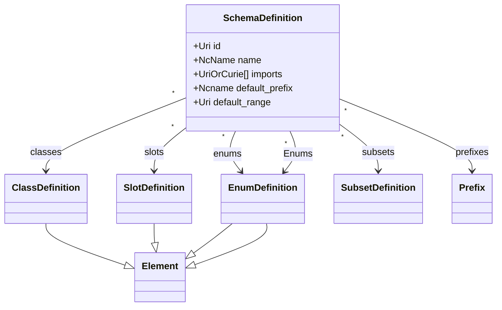
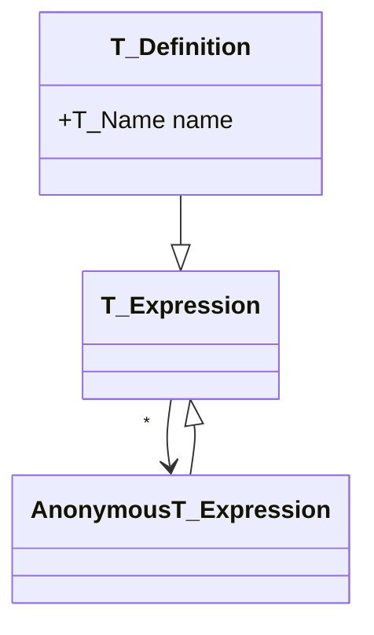
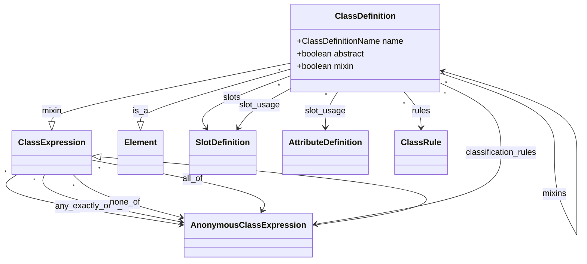
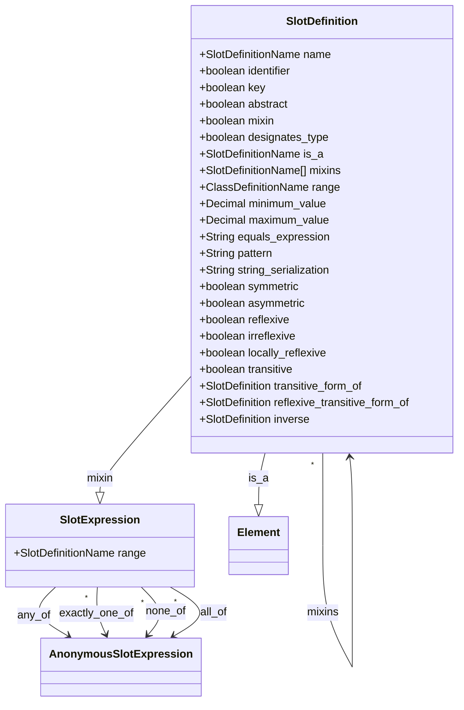
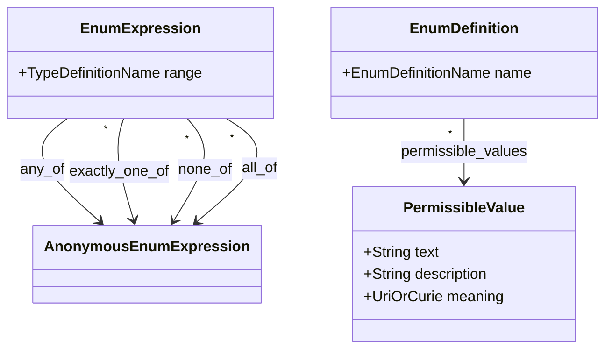
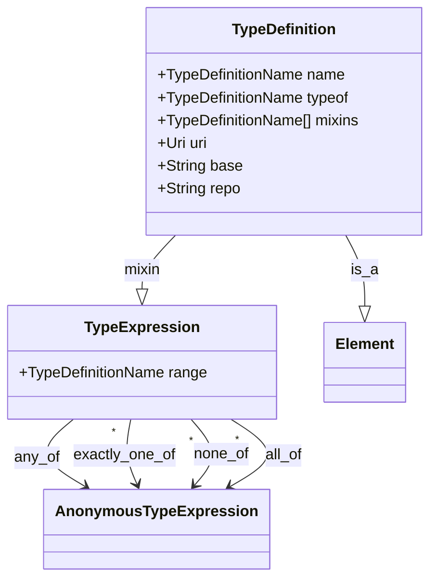
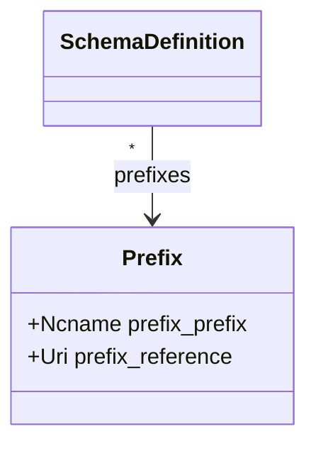

# LinkML Schemas

This section describes the *structure* of a LinkML schema. 

## Schema Basics

A LinkML **schema** specifies rules and structural conformance conditions for *instances*. Schemas allow for:

- parsing of instance **serializations** to LinkML instance structures
- structurally and semantically validating LinkML instance structures
- inferring missing values in LinkML instance structures

Every LinkML schema `m` is itself an instance of a special class `SchemaDefinition` that forms part of a special schema called the *LinkML metamodel* (abbreviated `MM`).
There is exactly one metamodel.

In this specification:

 - Classes in `MM` are called Metaclasses
 - Slots in `MM` are called Metaslots

The metamodel is itself expressed in LinkML, and the latest version can be browsed online

* [SchemaDefinition](https://w3id.org/linkml/SchemaDefinition)

A schema is canonically represented in YAML. This representation is the YAML serialization of a SchemaDefinition instance following the rules for YAML
serialization in the mapping section.

This specification specifies the *minimal elements* necessary to specify the behavior of LinkML schemas. Schemas may have additional
elements provided in the metamodel.

Formally a schema `m` consists at least of the following *elements*:

 * class definitions `MC = {c1,...}`, which group *instances*
 * slot definitions `MS = {s1, ...}`, which describe how instances relate to other instances
 * enum definitions `ME = {e1, ...}`, enumerated values (value sets)
 * Enum definitions `MT = {t1, ...}`, scalar/atomic Enums, such as integers, strings
 * subset definitions `MP = {ss1, ..}`, which partition model elements into groupings or views
 * URI prefixes `MU = {prefix1, ..}`, which partition model elements into groupings or views
 * imports `MI = {imp1, ..}`, which reference schemas that are reused
 * class definition references `MR = {r1,...}`, which group *pointers to instances*
 * model-level metadata

These are stored in the SchemaDefinition instance as follows:

|Path|Element|
|---|---|
| `m.classes` | `MC` |
| `m.slots` | `MS` |
| `m.enums` | `ME` |
| `m.Enums` | `MT` |
| `m.subsets` | `MP` |
| `m.imports` | `MI` |
| `m.prefixes` | `MU` |
| `m.<metaslot>` | model-level metadata |

the high level schema can be depicted as:



The metamodel makes use of the standard *types* library, see below

For example, consider a schema that models representations of individual people and organizations they belong to may include a class definition `Person`, and slot definitions for `name`, `address`, `relationships` and so on.

Because schemas, are instances of the metamodel, this hypothetical schema may be serialized in functional instance syntax as follows:

```
SchemaDefinition(
  id=String('http://example.org/organization'),
  classes=[
    ClassDefinition(
      name=String("Person"),
      slots=[
        String("id"),
        String("name"),
        String("height"),
        String("age"),
        ...
      ]
    ),
    ClassDefinition(
      name=String("Organization"),
      slots=[
        String("id"),
        ...
      ]
    ),
    ...
  ],
  slots=[
    SlotDefinition(
      name=String("id"),
      identifier=True,
      description=String("..."),
      range=String("String"),
      ...
    ),
    SlotDefinition(
      name=String("name"),
      description=String("..."),
      range=String("String"),
      ...
    )
  ],
  enums=[
     EnumDefinition(
       name=String("JobCode"),
       permissible_values=[...],
     )
  ],
  Enums=[
     EnumDefinition(
       name=String("Date"),
       ...
     ),
     EnumDefinition(
       name=String("String"),
       ...
     ),
  ]
)  
```

This maps to:

|Example Model: Organization Schema|
|---|
|`MC` Classes: *Person*, *Organization*, *Address*, ...|
|`MS` Slots: *id*, *name*, *date_of_birth*, *employed_at*, *lives_at*, ...|
|`ME` Enums: *JobCode*, ...|
|`MT` Enums: *Date*, *String*, ...|

To help understand the basic concepts, it can be helpful to think about analogous structures in other frameworks.
However, it should be understood these are not equivalents.

 * ClassDefinitions are analogous to: 
      - [classes](https://en.wikipedia.org/wiki/Class_(computer_programming)) in object-oriented languages 
      - tables in relational databases and spreadsheets
      - owl:Class entities in RDFS/OWL
 * SlotDefinitions are analogous to:
     - [attributes](https://en.wikipedia.org/wiki/Attribute_(computing)) in object-oriented languages
     - columns or fields in relational databases and spreadsheets
     - properties in JSON-Schema
     - rdf:Property entities in RDFS/OWL
 * EnumDefinitions are analogous to:
     - [enumerated Enums](https://en.wikipedia.org/wiki/Enumerated_Enum) in programming languages and some relational systems
     - Note however that in LinkML enums are optionally backed by stronger semantics with enum elements (permissible values) mapped to vocabularies or ontologies
 * EnumDefinitions are analogous to:
     - [data Enums](https://en.wikipedia.org/wiki/Data_Enum) in most OO languages 
     - primitive Enums in database systems
     - extensible Enums in some systems
     - rdf:Literals in RDF
     - DataEnums in OWL

## Elements and Expressions

For each of the 4 core element Enums `<T>`, there are a triad of 3 classes in the metamodel:

* `<T>Expression`
   * `Anonymous<T>Expression`
   * `<T>Definition`

depicted as:



For many purposes, all that is required is the Definition element. The purpose of the above abstraction is to allow
composition of anonymous expressions using boolean operators. For example, we may want to refer to the union of collection
of ClassDefinitions.

## Metaclasses

* metamodel documentation: [Element](https://w3id.org/linkml/Element)

The following describes the structure of schema elements. Each element of a schema instantiates a *Metaclass*

### ClassDefinition

* metamodel documentation: [ClassDefinition](https://w3id.org/linkml/ClassDefinition)

Instances of **ClassDefinition** are *instantiable*.

Any LinkML instance that instantiates a ClassDefinition will have zero to many slot-value assignments, constrained
by rules that operate off of the metaslot assignments of that class.

ClassDefinition inherits from both Element and ClassExpression. A ClassDefinition must have a *name*.
ClassDefinitions may refer to **AnonymousClassExpression**s as part of boolean expressions.



* `name` is a required field that uniquely identifiers the **ClassDefinition** within a schema
* `slots` is a list of slot names indicating the slots that are applicable for that class
* `slot_usage` is a list of slots that specifies more specific usage conditions for the slot in the context of this class
* `attributes` is a list of slots that are intended to be local to the class
* `is_a` is an optional parent class which this class inherits from
* `mixins` is a list of parent mixin class which this class inherits from
* `abstract` is a boolean indicating whether the class is intended to be directly instantiated
* `mixin` is a boolean indicating whether the class is intended to be uses as a mixin

An example collection of ClassDefinitions in a schema specified using the functional syntax might be:

```python
SchemaDefinition(
  classes=[
   ClassDefinition(
    name=String("NamedThing"),
    abstract=True,
    slots=[
        String("id"),
        String("name"),
        ...
      ]
    ),
   ClassDefinition(
    name=String("Person"),
    description=String("A person, living or dead"),
    is_a=String("NamedThing"),
    attributes=[
        SlotDefinition(
            name=String("height"),
            ...),
        SlotDefinition(
            name=String("age"),
            ...)
    ],
    ...
    )
```

This might be used to validate an instance:

```python
Person(id=String("P:123"),
       name=String("Alex"),
       height=...
       age=...)
```

See the next sections for validation rules

### SlotDefinition

* metamodel documentation: [SlotDefinition](https://w3id.org/linkml/SlotDefinition)

**SlotDefinition** is NOT *instantiable*. Each assignment in a LinkML **ClassDefinition** instance must use a SlotDefinition from the schema.

SlotDefinition inherits from both Element and SlotExpression. A SlotDefinition must have a *name*.
other schema elements may refer to **AnonymousSlotExpression**s composed using boolean operators.



An example collection of SlotDefinitions might be:

```python
SchemaDefinition(
  slots=[
   SlotDefinition(
    name=String("id"),
    identifier=True,
    description=String("A unique identifier for an object"),
    range=String("String"),
    ...
    ),
   SlotDefinition(
    name=String("name"),
    description=String("..."),
    range=String("String"),
    ...
    )
```

### EnumDefinition

* metamodel documentation: [EnumDefinition](https://w3id.org/linkml/EnumDefinition)

**EnumDefinition** instances are *instantiable*. 



### TypeDefinition

* metamodel documentation: [TypeDefinition](https://w3id.org/linkml/TypeDefinition)

**TypeDefinition** instances are *instantiable*.



See below for the standard types included with LinkML. These can be extended using `typeof`

### ClassDefinitionReferences

**ClassDefinitionReferences** are primitive elements that provide a way to reference a particular instances.

ClassDefinitionReferences are not part of the asserted metamodel but are derived from derivation rules -- see next section

## Other Schema Elements

### Prefixes

* metamodel documentation: [Prefix](https://w3id.org/linkml/Prefix)



Example:

```python
SchemaDefinition(
    prefixes=[
       Prefix(prefix_prefix=Ncname("linkml")
              prefix_reference=Uri("https://w3id.org/linkml/")),
       Prefix(prefix_prefix=Ncname("schema")
              prefix_reference=Uri("http://schema.org")),
       Prefix(prefix_prefix=Ncname("wgs")
              prefix_reference=Uri("http://www.w3.org/2003/01/geo/wgs84_pos#")),
       Prefix(prefix_prefix=Ncname("qudt")
              prefix_reference=Uri("http://qudt.org/1.1/schema/qudt#"))
    ])
```

## Composition of Expressions

## Built in and defined types

LinkML has a number of types defined in the types model, documented [here](https://linkml.io/linkml-model/docs/#types)

- Boolean (Bool) - A binary (true or false) value
- Date (XSDDate) - a date (year, month and day) in an idealized calendar
- Datetime (XSDDateTime) - The combination of a date and time
- Decimal (Decimal) - A real number with arbitrary precision that conforms to the xsd:decimal specification
- Double (float) - A real number that conforms to the xsd:double specification
- Float (float) - A real number that conforms to the xsd:float specification
- Integer (int) - An integer
- Ncname (NCName) - Prefix part of CURIE
- Nodeidentifier (NodeIdentifier) - A URI, CURIE or BNODE that represents a node in a model.
- Objectidentifier (ElementIdentifier) - A URI or CURIE that represents an object in the model.
- String (str) - A character string
- Time (XSDTime) - A time object represents a (local) time of day, independent of any particular day
- Uri (URI) - a complete URI
- Uriorcurie (URIorCURIE) - a URI or a CURIE


