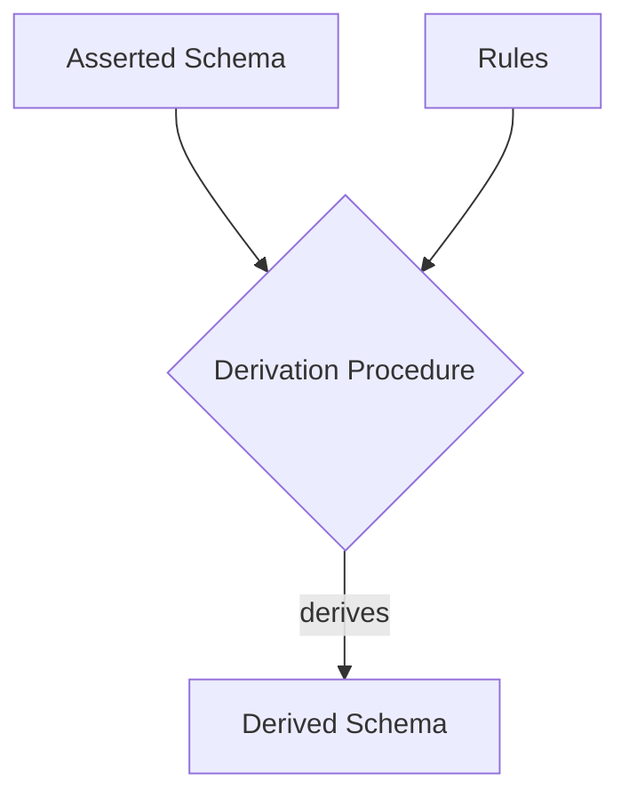

# Derived Schemas

This section describes rules that can be applied to a schema to obtain a *derived* (aka *induced*) schema.

The derived schema can be materialized, or it may be present as a *view* onto a schema. A derived view may also be referred to
as an *inferred* or *induced* view.

Derivations happen via *rules* that are specified below, using a set of convenience functions

## Conventions

We use `m` to denote the input or asserted schema (model), and `m*` to denote the derived schema

## Functions

### Function: ClassIdentifier

The function **ClassIdentifier**(`c`) takes a ClassDefinition or ClassDefinitionName as input and returns:

- the name of a derived attribute `s` in `c` where `s.identifier` is True in `m*`
- **None** if there is no such slot
- An error if there are multiple such slots

### Function: Closure

The function **Closure**(`x`, `s`) takes as input an element `x` and a metaslot `s` and returns the mathematical closure
of looking up `x.<s>`

The **ReflexiveClosure** includes `x`

### Function: Ancestors

The function **Ancestors**(`x`) returns the **Closure** of the **Parents** function applied to `x`. **Parents** itself is the union of `is_a` and `mixins`.

The function **ReflexiveAncestors** uses the **ReflexiveClosure**.

## Derivation Rules

### Rule: Model Imports

Each model imports zero to many imports, indicated by the **SchemaDefinition**.[imports](https://w3id.org/linkml/imports) metaslot.

`m*` is set to be the union of all schema elements from the **ReflexiveClosure** of `m.imports`

When copying an element `x` from an import into `m*`, the name `x.name` must be unique - if the same name has been used in another model, the derivation procedure fails, and an error is thrown.

**Note**: If two or more models import the same target (e.g. `m1` imports `m2` and `m3` and `m2` imports `m3`), `m3` will be only be resolved once.

**Note**: Two models are considered to be "identical" if they both 
have the same `id`.  If `m2` and `m3` both have `id: http://models-r.us/modelA`, it is assumed that, despite the different location, they represent the same thing.  LinkML _will_ check the model `version` field and will raise an error if `m2` has `version: 1.0.0` and `m3` has `version: 1.0.1`

Each imported module must be resolved - i.e the value of the import slot is mapped to a location on disk or on the web

### Rule: fromschema elements

Each element in the schema as assigned a metaslot `fromschema` value. This is the value of the `id` of the schema in which that element is defined.

This is preserved over imports, such that if `m` imports `m2`, and `m2` defines a class `c`, then `m*[c].fromschema` = m2

### Rule: Applicable Slot Names

The set of applicable slot names for a class `c` are determined by taking the union of:

* The names of all values of `x.attributes`
* The names of all values of `x.slots`

For all `x` in `ReflexiveAncestors(c)`

### Rule: Derived Attributes

Derived attributes can be calculated for every *applicable* slot name for any class `c`

`c.attributes[s] = DerivedAttributes(c,s)`

This is the combination of *asserted* attributes for c, as well as asserted attributes for ancestors of c,
as well as the SlotDefinition corresponding to that attribute, together with any overrides specified by `slot_usage` in `c`
and ancestors of `c`

- attributes asserted directly in `c.attributes` in the base schema
- attributes derived from each SlotDefinition `s` in `c.slots` by
    - looking up `s` in `m*.slots` and copying the slot-value assignments from these SlotDefinitions
    - overriding these slot-value assignments with any slot-value assignments provided by `c.slot_usage[s]`
- inheriting from parents of `c` using precedence rules
- inheriting from parents of `s`

The precedence rules for derived attributes are as follows:

If a metaslot `s` is declared `multivalued` then when copying `s` from a parent to a child, the values are appended.

If a metaslot `s` is declared `multivalued` 

if a slot is multi valued then copying will append, unless the element already exists.

if the slot is single valued, and intersection rules can be applied to the slot, then these are performed on all values

if the slot is single valued, and intersection rules cannot be applied to the slot, then the following precedence rules are applied:

 * metaslot values from slot_usage take the highest priority
 * metaslot values from the slot definition take the next highest priority
 * direct mixins take the next highest priority. where multiple direct mixins are provided as a list, the last element takes highest priority
 * direct is_as take the next highest priority
 * the above two rules are applied one level up, and then recursively applied

Intersection rules

|metaslot|rule|
|---|---|
|`maximum_value`|`min(v1,v2)`|
|`minimum_value`|`max(v1,v2)`|
|`pattern`|TBD|
|`range`|`IF subsumes(v1,v2) then v2`   `ELSE IF subsumes(v2,v1) then v2 ELSE UNDEFINED` |

If the result of applying any intersection rule is UNDEFINED then we fall back on precedence rules

### Rule: Default Range

For all attributes in the derived model, if a range is not assigned using the above method, then the range is assigned a value corresponding
to the value of `default_range` for the schema in which the slot is defined.

### Rule: Derived Class and Slot URIs

For each class or slot, if a class_uri or slot_uri is not specified, then this is derived by concatenating `m.default_prefix` with the CURIE separator `:` followed by the SafeUpperCamelCase encoding of the name of that class or slot definition

## Rule: Generation of patterns from structured patterns

For any slot `s`, if `s.structured_pattern = p` and `p` is not **None** then `s.pattern` is assigned a value based on the following
procedure:

If `p.interpolated` is True, then the value of `s.syntax` is *interpolated*, by replacing all occurrences of braced text `{VAR}`
with the value of `VAR`. The value of `VAR` is obtained using `m.settings[VAR]`, where `m` is the schema in which `p` is introduced.

If `p.interpolated` is not True, then the value of `s.syntax` is used directly.

If `p.partial_match` is not True, then `s.pattern` has a '^' character inserted at the begining and a '$' character inserted as the end.

### Rule: Generation of ClassDefinitionReferences

For every **ClassDefinition** `c`, if there exists a slot `s` such that `s.identifer=True`,
then a corresponding **ClassDefinitionReference** `r` is generated.

`r.name` is assigned to be the concatenation of `c.name` and `s.name`

`r` functionally serves as a *foreign key* to instances of `r`, and allows for non-inlined
representation of instance references in tree-based formats such as JSON.

## Structural Conformance Rules

### Rule: Each referenced entity must be present

Every **ClassDefinition**, **ClassDefinitionReference**, **SlotDefinitionReference**, **EnumDefinitionReference**, and **TypeDefinitionReference** must be resolvable within `m*`

However, not every element needs to be referenced. For example, it is valid to have a list of SlotDefinitions that are never used in `m*`.

### ClassDefinition Structural Conformance Rules

Each `c` in `m*.classes` must conform to the rules below:

- `c` must be an instance of a **ClassDefinition**
- `c` must have a unique name `c.name`, and this name must not be shared by any other class or element in `m*`
- `c` lists permissible slots in `c.slots`, the range of this is a reference to a SlotDefinition in `m*.slots`
- `c` defines how slots are used in the context of `c` via a collection of SlotDefinitions specified in `c.slot_usage`
- `c` may define local slots using `c.attributes`, the value of this is a. collection of SlotDefinitions
- `c` may have certain boolean properties defined such as `c.mixin` and `c.abstract`
- `c` must have exactly one value for `c.class_uri` in `m*`, and the value must be an instance of the builtin type UriOrCurie
- `c` may have parent ClassDefinitions defined via `c.is_a` and `c.mixins`
    - the value of `c.is_a` must be a ClassDefinitionReference
    - the value of `c.mixins` must be a collection of ClassDefinitonReferences
   - For any parent `p` of `c`, if `p.mixin` is True, then `c.mixin` SHOULD be True
- `c` includes additional rules in `c.rules` and `c.classificiation_rules`
- `c` may have any number of additional slot-value assignments consistent with the validation rules provided here with the metamodel `MM`

### SlotDefinition Structural Conformance Rules

Each `s` in `m*.slots` must conform to the rules below:

- `s` must be an instance of a **SlotDefinition**
- `s` must have a unique name `s.name`, and this name must not be shared by any other type or element
- `s` must have a range specified via `s.range` in `m*`
- `s` may have an assignment `s.identifier` which is True if `s` plays the role of a unique identifier
- `s` may have certain boolean properties defined such as `s.mixin` and `s.abstract`
- `s` must have exactly one value for `s.slot_uri` in `m*`, and the value must be an instance of the builtin type UriOrCurie
- `s` may have parent SlotDefinitions defined via `s.is_a` and `s.mixins`
    - the value of `s.is_a` must be a **SlotDefinitionReference**
    - the value of `s.mixins` must be a collection of **SlotDefinitionReference**s
    - For any parent `p` of `s`, if `p.mixin` is True, then `s.mixin` SHOULD be True
- `s` may have any number of additional slot-value assignments consistent with the validation rules provided here with the metamodel `MM`

### TypeDefinition Structural Conformance Rules

Each `s` in `m*.types` must conform to the rules below:

- `t` must be an instance of a **TypeDefinition**
- `t` must have a unique name `t.name`, and this name must not be shared by any other type or element
- `t` must have a mapping to an xsd type provided via `t.uri` in `m*`
- `t` may have a parent type declared via `t.typeof`
- `t` may have any number of additional slot-value assignments consistent with the validation rules provided here with the metamodel `MM`

### EnumDefinition Structural Conformance Rules

Each `e` in `m*.enums` must conform to the rules below:

- `e` must be an instance of a **EnumDefinition**
- `e` must have a unique name `e.name`, and this name must not be shared by any other enum or element
- `e` lists all static permissible values via `e.permissible_values`, the value of which is a list of instances of the MM class PermissibleValue
- `e` may have any number of additional slot-value assignments consistent with the validation rules provided here with the metamodel `MM`

### ClassDefinitionReference Structural Conformance Rules

Each `r` in `m*.class_references` must conform to the rules below:

- `r` must be an instance of a **ClassDefinitionReference**
- `r` must have a unique name `r.name`, and this name must not be shared by any other type or element

### Metamodel Conformance Rules

Both the asserted and derived schema should be valid instances of the LinkML metamodel **MM**
using the instance validation rules described in the next section