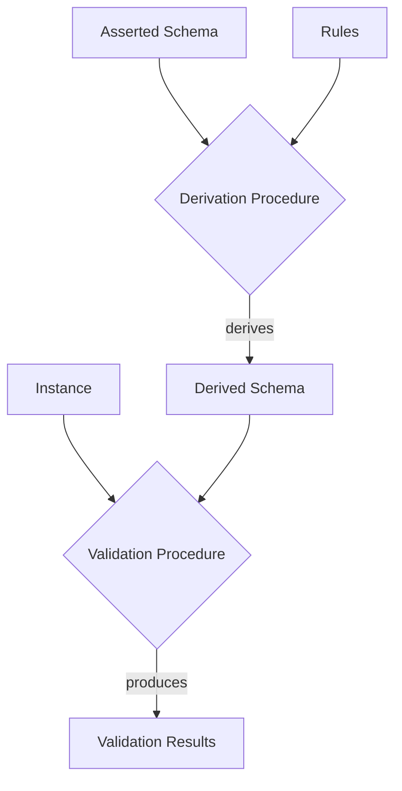

# Validation using Schemas

**Validation** is a procedure that takes as input:

* A LinkML instance structure `i`, where `i` is to be validated
* A LinkML instance structure `root`. This may be the same as `i`
* A *derived* schema `m*`

The validation procedure will produce output that can be used to determine if the instance is *structurally and semantically valid* according to the schema.

The following holds for any validation procedure:

- The output MUST include a boolean slot indicating whether the input can be demonstrated to be false
- The output SHOULD include additional information about the nature of all problems encountered. 
- The output SHOULD be conformant with the LinkML validation schema.
- The output MAY also return cases where *recommendations* are not adhered to
- The output MAY also be combined with parsing to yield the precise location (i.e. line numbers) in the source serialization document where problems are found.
- The procedure MAY restrict validation to defined subsets (profiles) of the Metamodel
- The procedure  SHOULD return in its payload an indication of which profile and version is used.

The validation procedure is to first take the metaclass that is instantiated by the type of the instance `i`,
and apply one of the 4 checks below, with each check performing its own sub-rules. The ClassDefinition check
is *recursive*, checking each slot-value assignment. This means a check on any instance will always validate the
full instance tree.

## Validation of ClassDefinitions

Given an instance `i` of a ClassDefinition:

*ClassDefinitionName*( `SVs` )

Where `SVs` is a collection of length `N`, with index `i..N` and members `slot_i=value_i`,
and *ClassDefinitionName* is the name of a ClassDefinition in `m*`, such that `C=m*.classes[ClassDefinitionName]`

### CD Rule: Assignment values must be valid

for each `slot=value` assignment in `SVs`, the validation procedure is performed on `value`, with
`root` remaining the same

### CD Rule: ClassDefinition instances must instantiate a class in the schema

*ClassDefinitionName* MUST be the name of a ClassDefinition in `m*`

`C` is assigned to be the value of `m*[ClassDefinitionName]`

`Atts` is assigned to be the value of `C.attributes` (see the previous section)

`C` SHOULD have all the following properties:

- `C.deprecated` SHOULD be **None**
- `C.abstract` SHOULD NOT be **True**
- `C.mixin` SHOULD NOT be **True**

### CD Rule: identifiers must be unique

We define a procedure **IdVal**(`i`) which yields the value of `i.<identifier_slot>` where `identifier_slot`
is the slot n `Atts` with metaslot assignment `identifier`=**True**

If there is no such slot then `**IdVal**(`i`) is None and this check is ignored.

`i` is invalid if there exists another instance `j` such that `j` is reachable from `root`,
and **IdVal**(`i`)=**IdVal**(`j`) and `i` and `j` are distinct.

### CD Rule: All assignments must be to permitted slots

For each `s=value` assignment in <*Assignment1*>, <*Assignment2*>, ..., <*AssignmentN*>:

- `s` must be in `Atts`

### Rule: All required slots must be specified

For each slot `s` in `Atts`, if `s.required=True`, then `i.<s>` must be neither `None` nor the empty collection `[]`

### Rule: All recommended slots should be specified

For each slot `s` in `Atts`, if `s.recommended=True`, then `i.<s>` should be neither `None` nor the empty collection `[]`

If this condition is not met, this is considered a warning rather than invalidity

### Rule: Assigned values must conform to multivalued cardinality

For each slot `s` in `Atts`,

 * if `s.multivalued` is True, then `i.<s>` must be a collection or None
 * If `s.multivalued` is False, then `i.<s>` must not be a collection

### Rule: values should be within stated bounds

For each slot `s` in `Atts`,

 * if `s.maximum_value` is not None, then `i.<s>` must be a number and must be less that or equal to the maximum value
 * if `s.minimum_value` is not None, then `i.<s>` must be a number and must be greater that or equal to the minimum value

### Rule: values should equal evaluable expression

For each slot `s` in `Atts`, if `s.equals_expression` is not None, then `i.<s>` must equal
the value of `Eval(s.equals_expression)`. See section on expression language
for details of syntax.

Note: this rule can be executed in inference mode

### Rule: values should equal string_serialization

For each slot `s` in `Atts`, if `s.string_serialization` is not None, then `i.<s>` must equal
the value of `Stringify(s.string_serialization)`. See section on expression language
for details of syntax.

### Rule: values should equal regular expression patterns

Note: this rule can be executed in inference mode

### Range class instantiation check

For each slot `s` in `Atts`, if `i.<s>` is not None, and `s.range` is in `m*.classes`,
then `s.range` must be in `ReflexiveAncestors(Type(i.<s>))`

 Additional checks MAY be performed based on whether `s.inlined` is True

 * if `s.inlined`, then `i.<s>`  SHOULD NOT be a Reference
 * if `s.inlined` is False, then EITHER:
     * `i.<s>`  SHOULD be a Reference
     * OR `i.<s>` instantiates a class `R` such that R has no slot `rs` that is declared to be an identifier. i.e. `rs.identifier = True`

### Range type check

For each slot `s` in `Atts`, if `i.<s>` is not None, and `s.range` is in `m*.types`,
where `i.<s> = *T*( **AtomicValue** )` must match `s.range`,

here `T.uri` is used to determine the type:

- for xsd floats, doubles, and decimals, AtomicValue must be a decimal- for xsd floats, doubles, and decimals, AtomicValue must be a decimal
- for xsd ints, AtomicValue must be an Integer
- for xsd dates, datetimes, and times, AtomicValue must be a string conforming to the relevant ISO type
- for xsd booleans, AtomicValue must be True or False

### Range enum check

For each slot `s` in `Atts`, if `i.<s>` is not None, and `s.range` is in `m*.enums`,
then `i.<s>` must be equal to `pv.text` for some pv in `m*.enums[s.range]`

### Boolean combinations of expressions

There are 4 boolean operator metaslots:

- any_of
- exactly_one_of
- none_of
- all_of

These can apply to classes, slots, types, or enums. The range is always a list of operand expressions
of the same type.

In all cases, the semantics are as follows:

- any_of: true if there exists a member of the operands that evaluates to true
  * for empty lists this is always false
- exactly_one_of: true if there exists a member of the operands that evaluates to true, and all other members evaluate to false
  * for empty lists this is always false
- none_of: true if there does not exist a member of the operands that evaluates to true
  * for empty lists this is always true
  * for lists of length 1 this is the same as the logical NOT operator
  * for lists of length 2 this is the same as the logical XOR operator
- all_of: true if there are no members that evaluate to false
  * for empty lists this is always true
   
### range expression checks

For each slot `s` in `Atts`, if `i.<s>` is not None, and `RE = s.range_expression` is not None, then a check
**CE**(`x`) is performed on `i.<s>`

### Rule evaluation

For each rule `r` in *C*.rules:

- if `r.preconditions` is None or `r.preconditions` is satisfied, then
- `r.postconditions` are applied

### Classification Rule evaluation

### type designator checks

## Inference of new values

